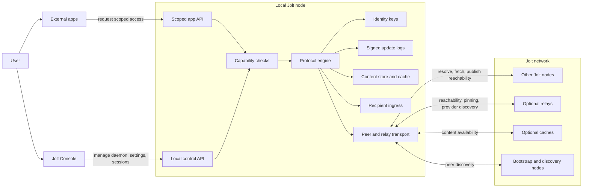

# Jolt

Jolt is a peer-to-peer distributed content syndication network.

It is for platformless content distribution: a person or community publishes
content under their own cryptographic identity, other nodes can discover and
fetch that content, and apps can build experiences on top without owning the
audience, the account, or the keys.

Jolt is experimental v0 software. This repository contains the protocol,
daemon, HTTP/app API, Console, and local network implementation. The current
code proves signed identity state, content-addressed retrieval, scoped app
authority, encrypted objects, reachability records, recipient-controlled
ingress, Linux packaging, and a first public bootstrap relay. The system is
still eventually consistent, developer-oriented, and not yet ready for normal
users.

## Why Jolt Exists

On X, Instagram, Facebook, and similar platforms, distribution is owned by the
platform:

- your identity is a platform account;
- your audience is a platform graph;
- your posts live behind platform APIs and moderation systems;
- the feed is ranked by platform rules;
- the app controls what moves, what is hidden, and what can be exported.

That model works because it is convenient. It is also fragile. If a platform
changes rules, declines, bans an account, shuts down APIs, or stops showing your
work, your distribution can disappear even if your content still exists.

Jolt explores a different model: content distribution should be anchored in the
publisher's identity, not in a platform account. Apps can still exist, but they
should be replaceable views over content and relationships the platform does not
own.

## How Jolt Is Different

| Platform applications | Jolt |
|---|---|
| Identity is an account on the platform | Identity is a key owned by the user |
| Content is stored and distributed by the platform | Content is signed, content-addressed, and fetched peer-to-peer |
| Audience and relationships live in the platform graph | Apps can build relationship models over Jolt identities |
| The platform interface defines how content is experienced | Interfaces are replaceable app-level views over signed content |
| Apps hold the user's authority | Apps request scoped permission from the local daemon |
| Availability depends on the platform | Availability can come from peers, caches, and authorized relays |

The core idea is syndication at the network layer. A Jolt identity publishes
signed state that maps identity-owned protocol paths to content IDs. Nodes
resolve that state, fetch content from peers, caches, or authorized relays, and
verify that updates were signed by the identity owner. Applications can
interpret the signed content however they choose; those application schemas are
not part of the protocol.

## Prior Art

Jolt is not the first project to work on user-owned identity or platformless
distribution. It borrows deliberately from earlier systems and differs from
each in specific ways:

- **Nostr:** Nostr identity is also a raw keypair, but keys are typically held
  by the client (or a signer extension), and distribution works by publishing
  events to relays that clients query. In Jolt, keys live in a local daemon
  that grants scoped capabilities to apps, content is content-addressed and
  fetched peer-to-peer, and relays are optional rendezvous and availability
  helpers rather than the primary data plane.
- **ATProto / Bluesky:** in ATProto, user data lives in a hosted PDS, global
  experiences depend on indexing infrastructure, and identity resolution uses
  a DID directory. Jolt has no required hosting and no global index: identity
  is a local signing key, mutable state is a signed update log, and resolution
  happens against peers and relays the user chooses.
- **ActivityPub:** federation ties identity and content to a home server;
  moving servers means migrating an account. Jolt identities are not tied to
  any server. A relay can improve a user's availability, but it can be
  replaced without changing the identity.
- **Secure Scuttlebutt:** probably Jolt's closest ancestor: key-owned, signed,
  append-only logs with offline-first replication. Jolt separates identity
  state (signed path-to-CID mappings with sequence numbers) from content
  blobs, so state is updatable rather than an ever-growing feed, and adds an
  explicit app permission boundary at the daemon.
- **IPFS / IPNS:** Jolt uses CIDs and libp2p, so it shares the
  content-addressing layer. But Jolt is not a permanent public filesystem, and
  it replaces IPNS-style mutable pointers with signed, sequenced update logs.
  Identity, encrypted envelopes, reachability records, recipient ingress, and
  app capabilities are protocol concerns in Jolt rather than layers left to
  applications.

If you know these systems well, the shortest summary is: Nostr-style key
identity, Scuttlebutt-style signed logs, IPFS-style content addressing, plus a
local capability-scoped daemon so applications never hold the user's keys.

## What Works Today

Jolt v0 has working implementations of the core protocol and local runtime
pieces:

- local daemon for identity, content, networking, and app permissions;
- Jolt Console for approving and revoking app access;
- `.jolt` identity addresses backed by signing keys;
- signed update logs for mutable identity-owned paths;
- content-addressed publish/fetch;
- encrypted content envelopes;
- app-scoped APIs with capability checks;
- peer discovery, local caching, and a built-in bootstrap relay;
- signed reachability records;
- recipient-controlled ingress for two-way app communication.

A separate application,
[Spoke](https://github.com/alexanderwanyoike/spoke), has been used as a proof
that external apps can use these primitives through scoped daemon access. Spoke
is useful evidence for the protocol boundary, but it is not part of this repo
and does not define Jolt's data model.

## Who Jolt Is For

Jolt is for people and communities that want content distribution without
depending on a single platform account, API, feed, or storage provider.

That includes:

- creators and communities that want portable publishing under identities they
  control;
- application developers who want to build interfaces without owning the user's
  keys, account, or distribution channel;
- protocol developers and researchers evaluating user-owned identity, signed
  state, encrypted content, and peer-aware transport;
- people operating peer, cache, relay, or availability infrastructure for a
  network they can participate in rather than merely consume.

Jolt v0 is still early. The first users are likely to be developers and
technical communities because setup, identity UX, packaging, and application
polish still need work. The goal is not to keep Jolt technical forever; the
goal is to make platformless distribution usable enough that normal users can
benefit from it through applications built on the network.

## What Jolt Is Not

Jolt does not provide global consensus, a shared ledger, tokens, mining,
staking, or smart contracts. It is not an economic network.

Jolt is not a permanent public filesystem. It uses content addressing, but
availability still depends on peers, local stores, caches, and authorized relays
that choose to keep content reachable.

Jolt is not a tunnel for arbitrary IP traffic. It does not create a private LAN
or route all application traffic. It moves signed identity state and
content-addressed objects through a peer-aware application transport.

Jolt is not a hosted application. Social networks, publishing tools, galleries,
release channels, notebooks, or other products can be built on top of it, but
those products are application schemas and interfaces above the protocol.

Jolt is not a replacement for application frameworks. Apps still own their UI,
domain model, validation, moderation choices, and product experience. Jolt
provides lower-level identity, reachability, content distribution, encryption,
and permission primitives.

## Current Limitations

The main v0 limitation is that the application-daemon boundary is not settled.
The current app APIs proved scoped authority, publish/fetch flows, and recipient
ingress, but the REST-style boundary may not be the right long-term interface
for live application state, subscriptions, and efficient local materialized
views.

Other important limitations:

- **Cross-platform packaging is young:** Linux release assets are verified;
  macOS and Windows CI packages exist, but still need human install/update
  smoke tests and production code-signing hardening.
- **Identity UX is rough:** `.jolt` addresses are long and not human-friendly.
- **No global discovery/search:** users need to know identities or receive them
  out of band.
- **Offline ingress is not solved:** direct recipient ingress works when the
  recipient is reachable; store-and-forward needs more design.
- **Relay policy needs hardening:** the built-in bootstrap relay is for
  discovery/rendezvous. Pinning must be authorized and abuse-limited before
  public relay storage is enabled.
- **Security needs review:** standard crypto primitives are used, but v0 has not
  had a full security review.

## Project Status

Jolt is now in a v0 freeze posture.

The experiment is mildly successful: Jolt can distribute signed content by
identity, external apps can use scoped local authority, and recipient ingress
proves two-way application communication at the protocol boundary. The next
question is not "can this work?" The next question is what the right v0 shape
should be.

Before adding more features, Jolt needs deeper review:

- project and protocol review;
- protocol optimization and security review;
- project documentation;
- v0 RFC design;
- a clearer application-daemon interface. The current REST-style boundary works
  for proving the idea, but it may not be the right long-term interface for
  local apps that need live state, subscriptions, and efficient materialized
  views.

New protocol features, app-store work, global search, relay metrics, and richer
application use-cases should wait until that review is done.

## Architecture



The main components are:

- **External apps:** untrusted clients that use app-level schemas and request
  scoped access from the local daemon. Apps do not receive raw identity keys.
- **Jolt Console:** the local control surface for daemon lifecycle, settings,
  app sessions, permission requests, and revocation.
- **Scoped app API:** the boundary between applications and the daemon. Every
  app action is checked against an approved capability.
- **Protocol engine:** the app-agnostic core that resolves identities, verifies
  signatures, publishes signed paths, fetches content IDs, encrypts/decrypts
  envelopes, and handles reachability.
- **Identity keys:** local signing keys that produce `.jolt` identities and
  authorize signed update-log entries.
- **Signed update logs:** mutable identity-owned state. A valid protocol update
  says identity `X` maps path `/some/path` to CID `Y` at sequence `N`.
- **Content store and cache:** local storage for content-addressed objects,
  encrypted envelopes, fetched data, and pinned content.
- **Recipient ingress:** the recipient-controlled path for incoming app-level
  messages or objects. The protocol carries the envelope; application policy
  decides what to accept, reject, or surface to the user.
- **Peer and relay transport:** networking for peer discovery, update-log
  resolution, content fetch, reachability records, and optional relay-assisted
  availability.
- **Optional relays and caches:** infrastructure that can improve reachability
  and availability, but only within configured policy. They are not a global
  permanent storage layer.

The protocol layer stays app-agnostic. It knows about identities, content IDs,
signed paths, update logs, reachability, encrypted objects, relays, pinning, and
capabilities. It does not know about posts, feeds, profiles, timelines, inboxes,
or contacts. Those are app-level schemas.

## Try It

Jolt v0 can be run from source or installed from tagged release assets.

The first packaged shape is:

```text
Jolt Console + bundled jolt daemon/CLI sidecar
user-callable jolt CLI
```

Linux remains the verified installer path. Tagged release CI also builds macOS
and Windows packages with the same Console/sidecar model:

```text
jolt-console-x86_64.AppImage
jolt-console-aarch64.dmg
jolt-console-aarch64.app.tar.gz
jolt-console-x86_64-setup.exe
jolt-linux-x86_64
jolt-macos-aarch64
jolt-windows-x86_64.exe
latest.json
```

The macOS `.app.tar.gz` asset is the signed Tauri updater payload; the `.dmg`
is the user-facing installer image.

Current macOS releases are not Apple Developer ID signed or notarized yet. If
macOS says `Jolt Console.app` is damaged after dragging it from the DMG into
`/Applications`, remove the download quarantine attribute and reopen it:

```bash
xattr -dr com.apple.quarantine "/Applications/Jolt Console.app"
open "/Applications/Jolt Console.app"
```

This is a v0 distribution workaround for the unsigned DMG, not the long-term
install story. Production macOS releases should use Apple signing and
notarization.

Prerequisite:

- Rust 1.89+
- Node.js and npm for Jolt Console

Build a Console package for the current host:

```bash
scripts/package-jolt-console.sh
```

The script builds the `jolt` daemon/CLI binary, stages it as the Tauri sidecar,
builds Console web assets, and produces the native bundle for the host OS. You
can choose the bundle explicitly:

```bash
scripts/package-jolt-console.sh --bundle appimage
scripts/package-jolt-console.sh --bundle dmg
scripts/package-jolt-console.sh --bundle nsis
```

Install or update Jolt Console and the user-callable `jolt` CLI with:

```bash
curl -fsSL https://raw.githubusercontent.com/alexanderwanyoike/jolt/main/scripts/install-jolt-console.sh | bash
```

The installer detects the host platform. On Linux, it downloads the latest
`jolt-console-x86_64.AppImage` and `jolt-linux-x86_64` release assets to:

```text
~/.local/bin/jolt-console
~/.local/bin/jolt
```

On macOS, the same installer downloads the `jolt-macos-aarch64` CLI to:

```text
~/.local/bin/jolt
```

On Windows, run the installer from Git Bash or another Bash-compatible shell. It
downloads the `jolt-windows-x86_64.exe` CLI to:

```text
~/.local/bin/jolt.exe
```

The macOS DMG and Windows setup EXE remain user-facing Console installers; the
Bash installer does not drop those installer packages into `~/.local/bin`.

Run the same command again to update both commands when a new tagged release is
available.

Fresh installs include a built-in bootstrap relay so a new node can join the
public demo network without manually configuring a first peer:

```text
/ip4/167.233.106.111/udp/4001/quic-v1/p2p/12D3KooWDmwLRmG4pZa7GcUM1P3CXM9TwMjtoM69QqTrwXD63tqi
```

The bootstrap relay is a rendezvous/discovery contact, not an authority. It
does not own identities, sign updates, decrypt content, or provide public
pinning. Users can add their own bootstrap relays, disable built-in defaults in
network settings, or start with `--no-bootstrap` for isolated/local demos.

Packaged Console builds also check GitHub Releases for signed in-app updates
using `latest.json`. The manifest contains `linux-x86_64`, `darwin-aarch64`,
and `windows-x86_64` entries when a tagged release publishes all three signed
updater artifacts. When a newer signed release is available, Console shows an
update action in the top bar and in Settings. Installing from Console verifies
the updater signature, stops only a Console-owned daemon if needed, applies the
update, and relaunches. The curl installer remains the Linux manual fallback if
an in-app update fails.

Check whether an update exists:

```bash
curl -fsSL https://raw.githubusercontent.com/alexanderwanyoike/jolt/main/scripts/install-jolt-console.sh | bash -s -- --check
```

Install only the headless `jolt` CLI for a relay or server:

```bash
curl -fsSL https://raw.githubusercontent.com/alexanderwanyoike/jolt/main/scripts/install-jolt-console.sh | bash -s -- --cli-only
```

On macOS and Windows, the default Bash installer path is already CLI-only. Use
the DMG or setup EXE from the release page for Console.

Install a specific version:

```bash
curl -fsSL https://raw.githubusercontent.com/alexanderwanyoike/jolt/main/scripts/install-jolt-console.sh | JOLT_VERSION=v0.1.0 bash
```

Check the installed AppImage:

```bash
jolt-console --appimage-help
```

Check the installed CLI:

```bash
jolt --version
```

Build Jolt:

```bash
cargo build --locked
```

Run a local daemon:

```bash
cargo run -p jolt-node -- start
```

Check status:

```bash
curl -fsS http://127.0.0.1:9862/api/v1/status | jq .
```

Run Jolt Console:

```bash
cd apps/jolt-console
npm install
npm run tauri dev
```

For a dev Console sidecar run, point Console at a built `jolt` binary:

```bash
JOLT_DAEMON_BINARY=../../target/debug/jolt npm run tauri dev
```

Try an external application proof:

```bash
git clone https://github.com/alexanderwanyoike/spoke
```

Spoke is a separate application that exercises Jolt app sessions and recipient
ingress. It is not part of this protocol repo and does not define the protocol
model. The setup is still manual.

External apps discover Jolt through the configured/default local daemon URL:

```text
http://127.0.0.1:9862
```

## Developer Notes

Crates:

| Crate | Purpose |
|---|---|
| `jolt-core` | Content IDs, `.jolt` addresses, reachability records, shared protocol types |
| `jolt-identity` | Ed25519 identity key management, signing, verification |
| `jolt-store` | Local content store, cache, pinning, eviction |
| `jolt-network` | Daemon node, P2P networking, fetch/resolve/update-log flows |
| `jolt-server` | HTTP daemon API and app API |
| `jolt-node` | CLI binary and daemon commands |
| `apps/jolt-console` | Tauri desktop Console |

Normal local verification:

```bash
./scripts/test-local.sh
```

Focused checks:

```bash
cargo test --locked --workspace --exclude jolt-console
npm test --prefix apps/jolt-console
npm run build --prefix apps/jolt-console
```

## Documentation

Design notes and implementation cards live in [`docs/`](docs/). Current planning
cards are in [`docs/cards/`](docs/cards/).

## License

MIT
