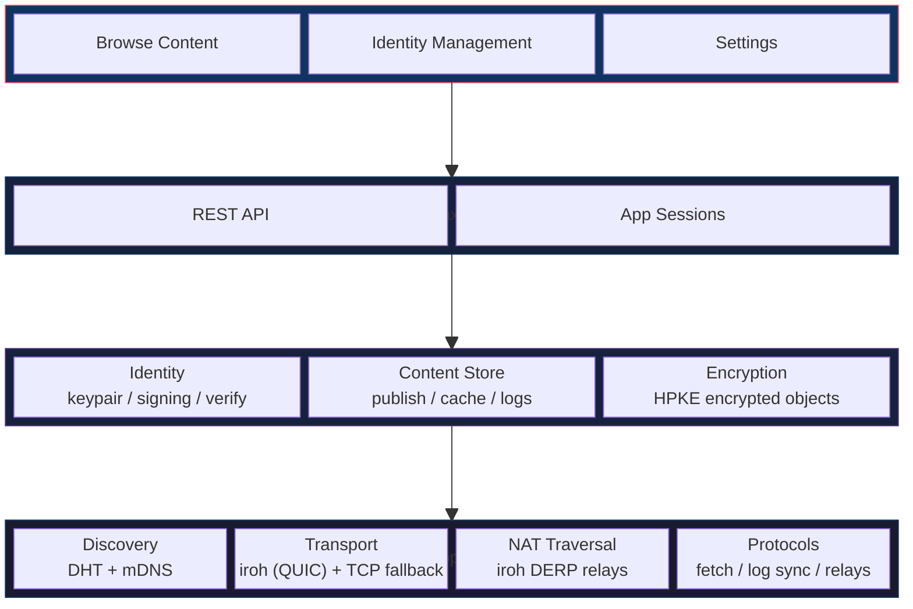
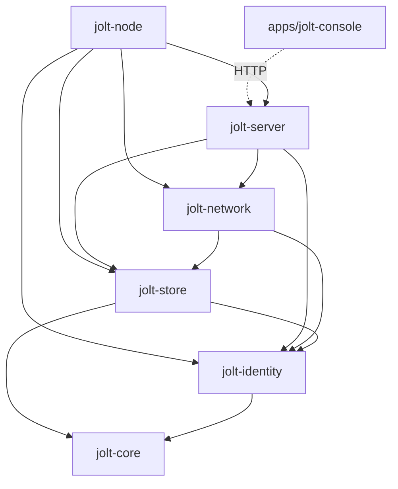

# jolt Architecture

## Overview

A jolt node is a single binary that runs on a user's machine. It combines a P2P networking layer, a local content store, and an HTTP server that exposes a REST API. The desktop UI is a separate Tauri app (jolt-console) that talks to the local daemon over that API. Apps run outside the daemon and connect through capability-scoped sessions (see [App Boundary and Sessions](15-app-boundary-and-sessions.md)).



## Crate Structure

```
jolt/
  crates/
    jolt-core/        # shared types: content addressing, update logs, manifests, encryption
    jolt-identity/    # keypair management, signing, verification
    jolt-network/     # libp2p + iroh setup, protocols, peer discovery, fetching
    jolt-store/       # filesystem content store, cache, log persistence
    jolt-server/      # axum HTTP server, REST API, app sessions
    jolt-node/        # CLI entry point, node configuration, orchestration
  apps/
    jolt-console/     # Tauri desktop app (UI over the REST API)
```

An earlier design also had `jolt-crypto`, `jolt-runtime`, `jolt-apps`, and `jolt-content` crates. They were never built: encryption lives in jolt-core (`encrypted_object`, an HPKE envelope), the content store and cache live in jolt-store, fetching and resolution live in jolt-network, and the in-process app runtime was abandoned in favor of external apps with capability-scoped sessions (see [App Boundary and Sessions](15-app-boundary-and-sessions.md)).

## Crate Dependency Graph



All crates depend on jolt-core; only the interesting edges are drawn.

## Key Dependencies

| Crate | Purpose |
|---|---|
| `rust-libp2p` | P2P networking: DHT, mDNS, request-response protocols |
| `iroh` + `libp2p-iroh` | Primary QUIC transport; DERP relays for NAT traversal |
| `axum` | HTTP server for the REST API |
| `ed25519-dalek` | Identity keypair, signing, verification |
| `hpke` (x25519 feature) | Public-key encryption envelopes for encrypted objects |
| `chacha20poly1305` | Symmetric encryption |
| `argon2` | Key derivation for identity export/recovery |
| `blake3` | Content and log-entry hashing |
| `cid` / `multihash` | Content addressing (IPFS-compatible CIDs) |
| `data-encoding` | Base32 identity addresses |
| `serde` + `ciborium` | CBOR on the network wire; local persistence is JSON files |
| `tokio` | Async runtime |
| `tracing` | Structured logging |

## Component Responsibilities

### jolt-core

Shared types used across all crates.

- `ContentId` -- content-addressed identifier (CID wrapping a BLAKE3-256 multihash)
- `IdentityId` -- identity of a user on the network (lowercase base32 of an ed25519 public key)
- `ContentManifest` -- signed metadata describing published content (content_id, size, content_type, publisher_key, signature)
- `UpdateLog` -- append-only signed log of changes to a user's published content
- `device_writer_log` -- per-device writer logs and merged identity state (see [doc 20](20-true-multi-writer-identity-and-devices.md))
- `encrypted_object` -- HPKE encryption envelope for private content (see [doc 16](16-encrypted-object-envelope.md))
- `identity_authority`, `identity_encryption_key`, `identity_head_hint` -- device authorization and identity key records
- `pin_request`, `reachability`, `relay_record` -- relay pinning and signed reachability records

### jolt-identity

Manages the user's cryptographic identity.

- Generate and store Ed25519 keypairs
- Sign data (update logs, manifests, messages)
- Verify signatures from other peers
- Publish and verify signed identity encryption key records
- Identity export/import for backup

### jolt-network

P2P networking layer built on libp2p.

- Node bootstrap and peer discovery (Kademlia DHT + mDNS)
- Request-response protocols (CBOR over libp2p): `content_fetch`, `update_log_sync`, `device_writer_sync`, `relay_exchange`, plus `kademlia` and `identify` behaviours
- Content fetching via `FetchManager` (request content by ContentId from peers and DHT providers)
- Update-log and device-writer-log sync between peers
- Transports: iroh (QUIC) as primary, TCP + noise + yamux as fallback
- NAT traversal handled by iroh's DERP relays

There is no peer-to-peer messaging protocol; direct messaging is not implemented.

### jolt-store

Local data persistence, filesystem-based with JSON sidecar files.

- Directory layout: `published/`, `cache/`, `update_logs/`, `device_writer_logs/`, plus JSON index files
- Content-addressed blob storage for published and cached content
- Cache management (LRU eviction, configurable max size, pinning)
- Update log and device-writer log persistence

There is no embedded database and no per-app storage; the abandoned in-process app model's storage duties never materialized (see [doc 15](15-app-boundary-and-sessions.md)).

### jolt-server

HTTP interface for the console UI and apps.

- REST API for node management (identity, content, peers, publishing)
- Capability-scoped app sessions (see [doc 15](15-app-boundary-and-sessions.md))
- Localhost-only binding (security)
- Resolve `<identity>.jolt` addresses to content (see below)

### jolt-node

The entry point that ties everything together.

- CLI interface (start, stop, configure)
- Node configuration (ports, storage paths, limits)
- Bootstrap and initialization sequence
- Graceful shutdown
- Logging and diagnostics

## Jolt Addresses (`<identity>.jolt`)

Content on the network is addressed by identity and path:

```
<base32-identity>.jolt/<path>
```

Examples:

```
mfrggzdfmztwq2lk...abc.jolt/blog/hello-world   -> a user's published content
mfrggzdfmztwq2lk...abc.jolt                    -> a user's root (path defaults to /)
```

The identity label is the lowercase base32 (no padding) encoding of the user's ed25519 public key, fitting in a single DNS label. Addresses must end with the `.jolt` suffix and may carry a path; query strings and fragments are rejected.

### Resolution

When the node receives a jolt address, it:

1. Parses the address into an `IdentityId` and normalized path
2. Resolves the identity's update log (and device-writer logs) to find the ContentId at that path
3. Fetches the content by ContentId from the network and verifies it against the hash

See [Global Jolt Resolution](12-global-jolt-resolution.md) for the authoritative description of the address format and resolution pipeline.

### OS protocol handler

> Future design, not implemented in v0.

A custom OS-level protocol handler would let jolt links work anywhere -- browsers, email clients, chat apps, terminals -- without a browser extension, using the same mechanism as Zoom (`zoommtg://`), Spotify (`spotify://`), and Steam (`steam://`):

| Platform | Method |
|---|---|
| Linux | `.desktop` file in `~/.local/share/applications/` with an `x-scheme-handler` MimeType |
| macOS | `CFBundleURLTypes` in the app's `Info.plist` |
| Windows | Registry key under `HKEY_CLASSES_ROOT` |
