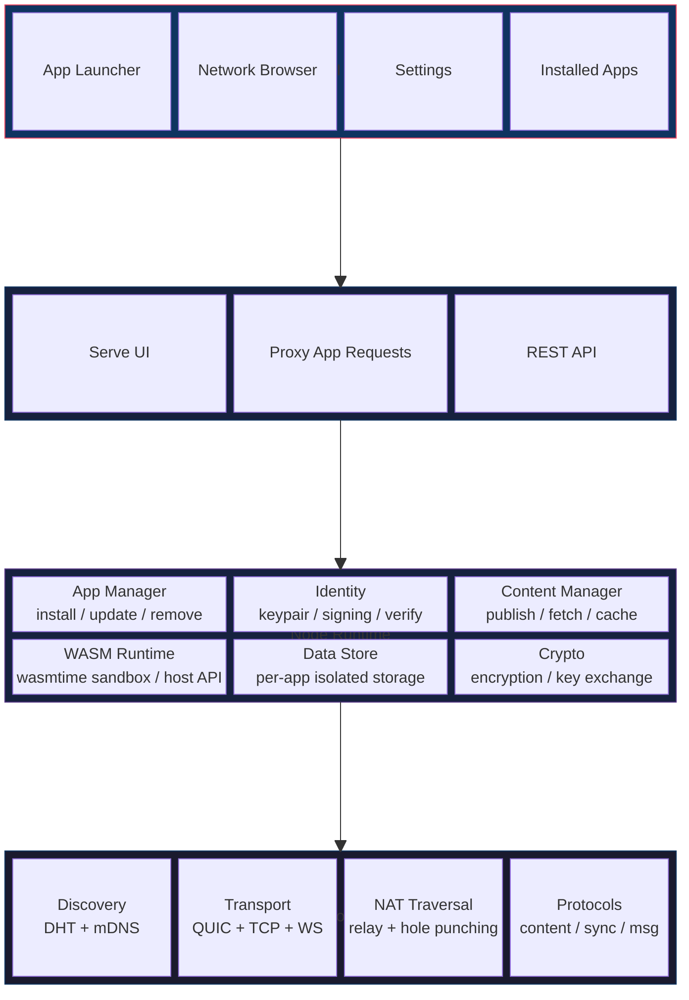
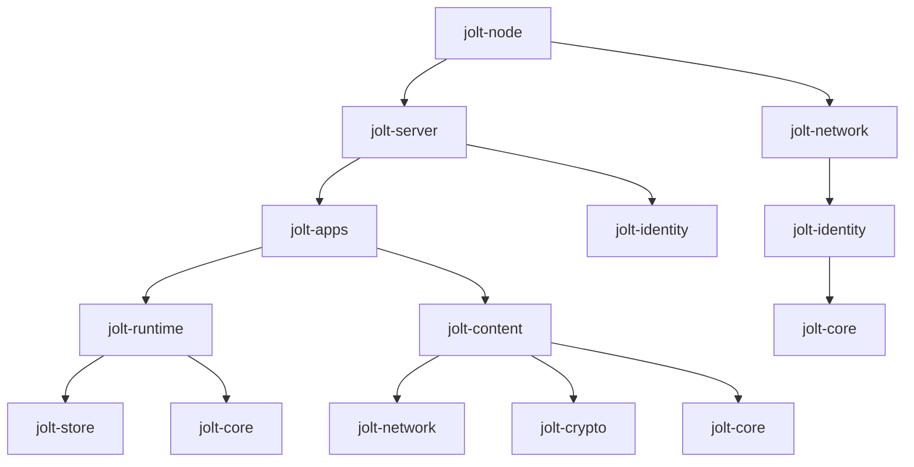

# jolt Architecture

## Overview

A jolt node is a single binary that runs on a user's machine. It combines a P2P networking layer, a WASM application runtime, a local data store, and an HTTP server that serves a browser-based UI.



## Crate Structure

```
jolt/
  crates/
    jolt-core/        # shared types, content addressing, manifests
    jolt-identity/    # keypair management, signing, verification
    jolt-crypto/      # encryption, key exchange, access control
    jolt-network/     # libp2p setup, protocols, peer discovery
    jolt-store/       # embedded database, per-app data isolation
    jolt-runtime/     # wasmtime WASM sandbox, host API
    jolt-apps/        # app lifecycle: install, update, remove, permissions
    jolt-content/     # content publishing, fetching, caching
    jolt-server/      # axum HTTP server, REST API, browser UI proxy
    jolt-node/        # CLI entry point, node configuration, orchestration
  web/                # browser UI (HTML/CSS/JS frontend)
```

## Crate Dependency Graph



## Key Dependencies

| Crate | Purpose |
|---|---|
| `rust-libp2p` | P2P networking, DHT, mDNS, relay, NAT traversal |
| `axum` | HTTP server for browser UI and REST API |
| `wasmtime` | WASM runtime with sandboxing |
| `sled` or `rusqlite` | Embedded local database |
| `ed25519-dalek` | Identity keypair, signing, verification |
| `x25519-dalek` | Key exchange for encryption |
| `chacha20poly1305` | Symmetric encryption for content |
| `cid` / `multihash` | Content addressing (IPFS-compatible) |
| `serde` + `ciborium` | Serialization (CBOR for wire format) |
| `tokio` | Async runtime |
| `tracing` | Structured logging |

## Component Responsibilities

### jolt-core

Shared types used across all crates.

- `ContentId` -- content-addressed identifier (multihash of content bytes)
- `PeerId` -- identity of a node on the network (derived from public key)
- `AppManifest` -- metadata describing a published app
- `UpdateLog` -- append-only signed log of changes to a user's published content
- Serialization formats

### jolt-identity

Manages the user's cryptographic identity.

- Generate and store Ed25519 keypairs
- Sign data (update logs, manifests, messages)
- Verify signatures from other peers
- Derive X25519 keys for encryption from Ed25519 identity
- Identity export/import for backup

### jolt-crypto

Encryption and access control.

- Encrypt content for specific recipients (public key encryption)
- Group key management (create, distribute, rotate)
- Encrypt/decrypt content at rest
- Key derivation for per-app secrets

### jolt-network

P2P networking layer built on libp2p.

- Node bootstrap and peer discovery (DHT + mDNS)
- Content fetching protocol (request content by ContentId)
- App sync protocol (exchange update logs between peers)
- Messaging protocol (direct peer-to-peer messages)
- NAT traversal via relay nodes and hole punching
- Bandwidth management and connection limits

### jolt-store

Local data persistence.

- Embedded database (sled or SQLite)
- Per-app isolated namespaces (app A cannot read app B's data)
- Content-addressed blob storage for cached content
- KV store API exposed to WASM apps via host functions
- Storage quotas and garbage collection

### jolt-runtime

WASM application execution environment.

- Load and execute WASM binaries via wasmtime
- Host API functions exposed to WASM apps (see 04-wasm-runtime.md)
- Capability-based permission enforcement
- Resource limits (CPU time, memory, storage)
- App isolation (each app runs in its own sandbox)

### jolt-apps

Application lifecycle management.

- Install app from network (download WASM + assets by ContentId)
- Update app (check developer's update log, prompt user)
- Remove app (delete binary, optionally delete data)
- App registry (list installed apps, metadata)
- Permission management (grant/revoke capabilities per app)

### jolt-content

Content publishing and distribution.

- Publish local files/directories to the network
- Content-addressed storage and retrieval
- Cache management (LRU eviction, size limits)
- Update log management (append entries, resolve latest)
- Pinning (explicitly cache and serve specific content)

### jolt-server

HTTP interface for the browser UI and apps.

- Serve the browser UI (app launcher, network browser, settings)
- REST API for node management (identity, apps, content, peers)
- Proxy requests from browser to installed WASM apps
- WebSocket support for real-time updates
- Localhost-only binding (security)
- Resolve `jolt://` URIs to local content (see below)

### jolt-node

The entry point that ties everything together.

- CLI interface (start, stop, configure)
- Node configuration (ports, storage paths, limits)
- Bootstrap and initialization sequence
- Graceful shutdown
- Logging and diagnostics
- Register `jolt://` protocol handler with the OS on install

## Protocol Handler (`jolt://` links)

jolt registers a custom protocol handler with the operating system on install. This allows `jolt://` links to work anywhere -- browsers, email clients, chat apps, terminals -- without a browser extension.

### How it works

1. On install, the node registers as the OS handler for the `jolt://` protocol
2. User clicks a `jolt://` link anywhere on their system
3. The OS routes it to the jolt node process
4. The node resolves the link and opens it in the user's default browser via localhost

### URI format

```
jolt://<peer-public-key>/<path>
jolt://<content-id>
```

Examples:

```
jolt://ed25519:a1b2c3d4/blog/hello-world    -> a user's published content
jolt://ed25519:a1b2c3d4/apps/chat            -> a user's published app
jolt://bafk...xyz                            -> content by hash (any provider)
```

### Resolution

When the node receives a `jolt://` URI, it:

1. Parses the URI into either a peer key + path, or a raw ContentId
2. For peer URIs: resolves the peer's update log to find the content at that path
3. For content URIs: fetches directly by ContentId from the network
4. Redirects the browser to `http://localhost:<port>/view/<resolved-content>` to display it

### OS registration

| Platform | Method |
|---|---|
| Linux | `.desktop` file in `~/.local/share/applications/` with `MimeType=x-scheme-handler/jolt` |
| macOS | `CFBundleURLTypes` in the app's `Info.plist` |
| Windows | Registry key under `HKEY_CLASSES_ROOT\jolt` |

This is the same mechanism used by Zoom (`zoommtg://`), Spotify (`spotify://`), and Steam (`steam://`).
