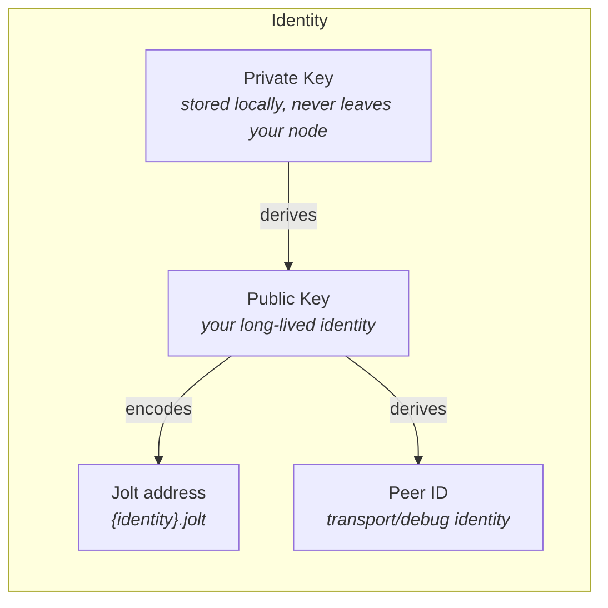
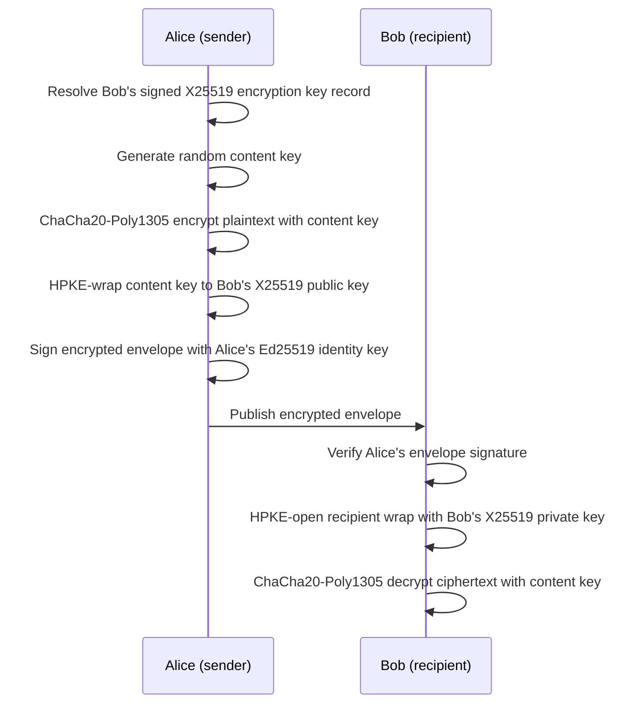
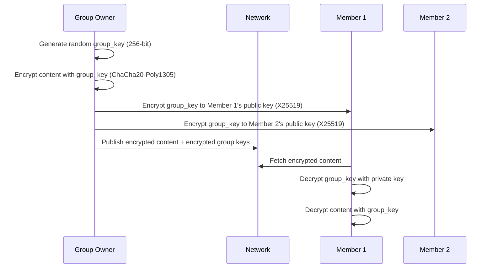
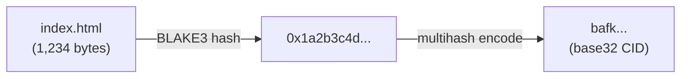

# Identity and Cryptography

## Identity Model

> Design update: Jolt is moving toward true multi-writer identities with
> authorized, revocable device writers. See
> [True Multi-Writer Identity and Devices](20-true-multi-writer-identity-and-devices.md).
> The older single-key model below describes the current v0 implementation and
> migration starting point.

Every jolt user is identified by an Ed25519 keypair. There is no central identity registry. Your public key is your identity.



### Key Generation

On first launch, the node generates an Ed25519 keypair and stores it in the local configuration directory.

```
~/.jolt/
  identity/
    keypair.bin        # raw Ed25519 signing key bytes (unencrypted in v0)
    public_key.pub     # shareable public key
```

In v0 the private key is stored unencrypted as raw signing-key bytes, protected only by file permissions (`0600`). Encryption at rest (a passphrase-derived key, e.g. Argon2id key derivation with ChaCha20-Poly1305) is planned but not yet implemented. See [Identity Import and Export v0](18-identity-import-export.md), which documents the same limitation.

### Canonical Identity Addresses

Jolt addresses people by long-lived identity key, not by current device, relay, or content ID.

The canonical v0 address format is:

```text
{identity}.jolt
{identity}.jolt/profile
{identity}.jolt/feed
{identity}.jolt/posts/hello
```

`{identity}` is the lowercase base32, no-padding encoding of the 32-byte Ed25519 public identity key. This keeps the identity host within one DNS-style label while preserving enough information to recover the public key.

Peer IDs remain visible for transport, debugging, and manual peer connections. They are not the primary human-facing address.

### Human-Readable Names

> Future design, not implemented in v0. There is no petname or nickname code today; local identities only carry a self-assigned label.

Identity addresses are still not user-friendly. The plan is a petname system where users assign local nicknames to identities they interact with.

```
Your local petnames (stored on YOUR node only):
  "alice"   -> {identity}.jolt
  "bob"     -> {identity}.jolt
  "mom"     -> {identity}.jolt
```

Petnames would be local. Alice might call Bob "bob" while Carol calls him "robert." There would be no global username registry, which avoids squatting and governance problems.

Users would also be able to set a **display name** in their profile that other nodes can read, but it would not be unique or verified -- just a hint.

### Identity Backup and Recovery

- Export keypair as an encrypted file for backup
- Import keypair on a new device to maintain identity
- If the key is lost, the identity is lost (there is no "forgot password" -- this is a conscious trade-off)

See [Identity Import and Export v0](18-identity-import-export.md) for the
cautious v0 recovery-bundle design, including shared-key risks and the future
delegated-device direction.

### Multiple Identities

A user can create multiple keypairs for different contexts (personal, professional, anonymous). The node supports switching between identities.

### Devices

The target model separates user identity from device authority. A user identity
is the durable `.jolt` namespace. Devices are authorized writers for that
namespace and can be revoked independently. Device keys should sign device
writer logs, while the user identity's root authority signs device grants and
revocations.

## Cryptography

### Signing

All published content is signed by the publisher's Ed25519 key.

```
Signed content:
  payload:    the content bytes
  signature:  Ed25519 sign(private_key, payload)
  public_key: publisher's public key

Verification:
  Ed25519 verify(public_key, payload, signature) -> bool
```

The message bytes are signed directly with pure Ed25519, which hashes internally; there is no separate pre-hash step.

Signatures provide:
- **Authenticity** -- proof that the content came from the claimed author
- **Integrity** -- proof that the content hasn't been modified
- **Non-repudiation** -- the author can't deny publishing it

### Encryption

jolt uses a hybrid encryption scheme for private content.

> Design update: encrypted object work continues in
> [Encrypted Object Envelope](16-encrypted-object-envelope.md). That design uses
> separate identity encryption key records signed by the identity, rather than
> deriving X25519 encryption keys from the Ed25519 identity key.

#### Encrypting for a Single Recipient



#### Encrypting for a Group



Group membership changes:
- **Adding a member:** Encrypt the group key to the new member's public key
- **Revoking a member:** Generate new group key, re-encrypt to remaining members. New content uses new key (old content remains accessible to revoked member)

### Content Addressing

All content in jolt is addressed by its hash.



```
ContentId = multihash(blake3(content_bytes))
```

Properties:
- **Deterministic** -- same content always produces the same ID
- **Verifiable** -- anyone can hash the content and confirm the ID matches
- **Cacheable** -- content at a given ID never changes (immutable)
- **Deduplicatable** -- identical content across the network shares one ID

Using BLAKE3 for hashing (fast, secure, parallelizable). The CID format is compatible with IPFS for potential interoperability.

### Wire Protocol Encryption

All P2P connections are encrypted using the libp2p Noise protocol (Noise_XX handshake with Ed25519 keys). This provides:

- Encrypted transport (no eavesdropping)
- Mutual authentication (both peers verify each other's identity)
- Forward secrecy (compromising a key doesn't compromise past sessions)
