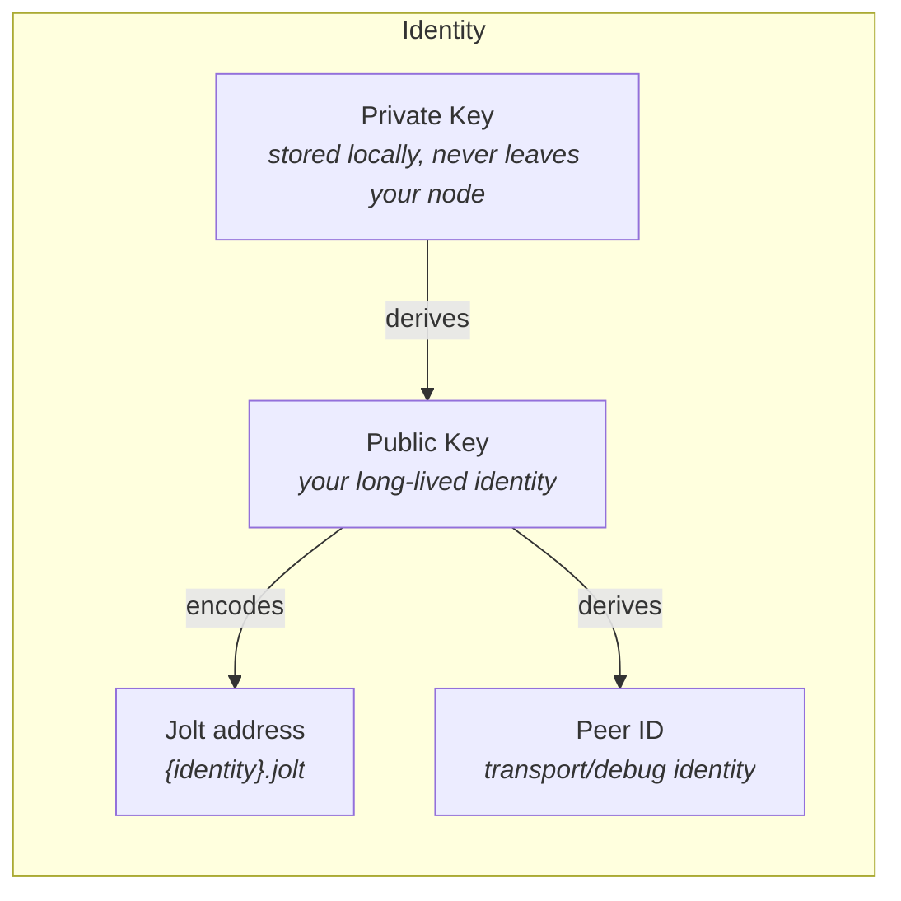
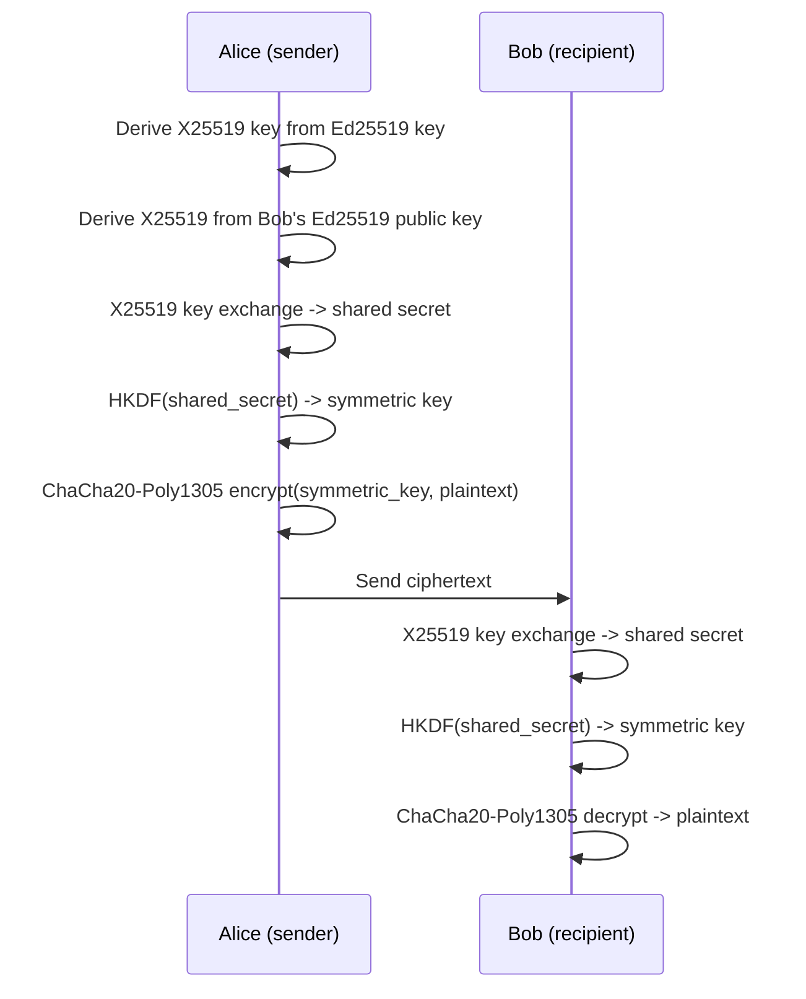
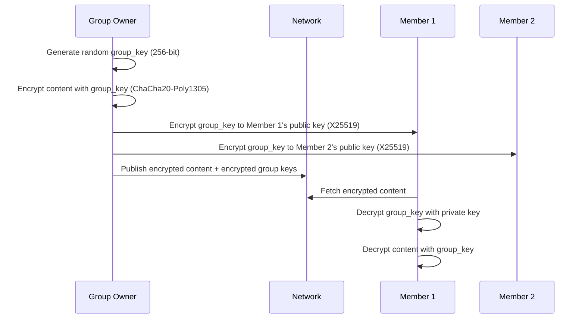
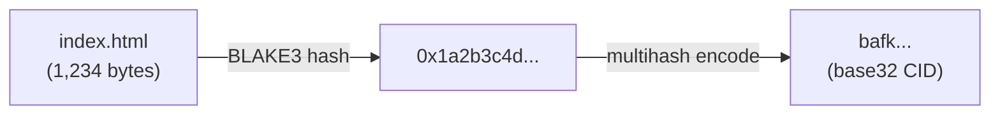

# Identity and Cryptography

## Identity Model

Every jolt user is identified by an Ed25519 keypair. There is no central identity registry. Your public key is your identity.



### Key Generation

On first launch, the node generates an Ed25519 keypair and stores it in the local configuration directory.

```
~/.jolt/
  identity/
    keypair.enc        # encrypted with a user passphrase
    public_key.pub     # shareable public key
```

The private key is encrypted at rest using a passphrase-derived key (Argon2id for key derivation, ChaCha20-Poly1305 for encryption).

### Canonical Identity Addresses

Jolt addresses people by long-lived identity key, not by current device, relay, or content ID.

The canonical v0 address format is:

```text
{identity}.jolt
{identity}.jolt/profile
{identity}.jolt/feed
{identity}.jolt/posts/hello
```

`{identity}` is the lowercase base32, no-padding encoding of the 32-byte Ed25519 public identity key. This keeps the identity host within one DNS-style label while preserving enough information to recover the public key.

Peer IDs remain visible for transport, debugging, and manual peer connections. They are not the primary human-facing address.

### Human-Readable Names

Identity addresses are still not user-friendly. Jolt supports a petname system where users assign local nicknames to identities they interact with.

```
Your local petnames (stored on YOUR node only):
  "alice"   -> {identity}.jolt
  "bob"     -> {identity}.jolt
  "mom"     -> {identity}.jolt
```

Petnames are local. Alice might call Bob "bob" while Carol calls him "robert." There is no global username registry, which avoids squatting and governance problems.

Users can also set a **display name** in their profile that other nodes can read, but it's not unique or verified -- just a hint.

### Identity Backup and Recovery

- Export keypair as an encrypted file for backup
- Import keypair on a new device to maintain identity
- If the key is lost, the identity is lost (there is no "forgot password" -- this is a conscious trade-off)

### Multiple Identities

A user can create multiple keypairs for different contexts (personal, professional, anonymous). The node supports switching between identities.

## Cryptography

### Signing

All published content is signed by the publisher's Ed25519 key.

```
Signed content:
  payload:    the content bytes
  signature:  Ed25519 sign(private_key, hash(payload))
  public_key: publisher's public key

Verification:
  Ed25519 verify(public_key, hash(payload), signature) -> bool
```

Signatures provide:
- **Authenticity** -- proof that the content came from the claimed author
- **Integrity** -- proof that the content hasn't been modified
- **Non-repudiation** -- the author can't deny publishing it

### Encryption

jolt uses a hybrid encryption scheme for private content.

#### Encrypting for a Single Recipient



#### Encrypting for a Group



Group membership changes:
- **Adding a member:** Encrypt the group key to the new member's public key
- **Revoking a member:** Generate new group key, re-encrypt to remaining members. New content uses new key (old content remains accessible to revoked member)

### Content Addressing

All content in jolt is addressed by its hash.



```
ContentId = multihash(blake3(content_bytes))
```

Properties:
- **Deterministic** -- same content always produces the same ID
- **Verifiable** -- anyone can hash the content and confirm the ID matches
- **Cacheable** -- content at a given ID never changes (immutable)
- **Deduplicatable** -- identical content across the network shares one ID

Using BLAKE3 for hashing (fast, secure, parallelizable). The CID format is compatible with IPFS for potential interoperability.

### Wire Protocol Encryption

All P2P connections are encrypted using the libp2p Noise protocol (Noise_XX handshake with Ed25519 keys). This provides:

- Encrypted transport (no eavesdropping)
- Mutual authentication (both peers verify each other's identity)
- Forward secrecy (compromising a key doesn't compromise past sessions)
