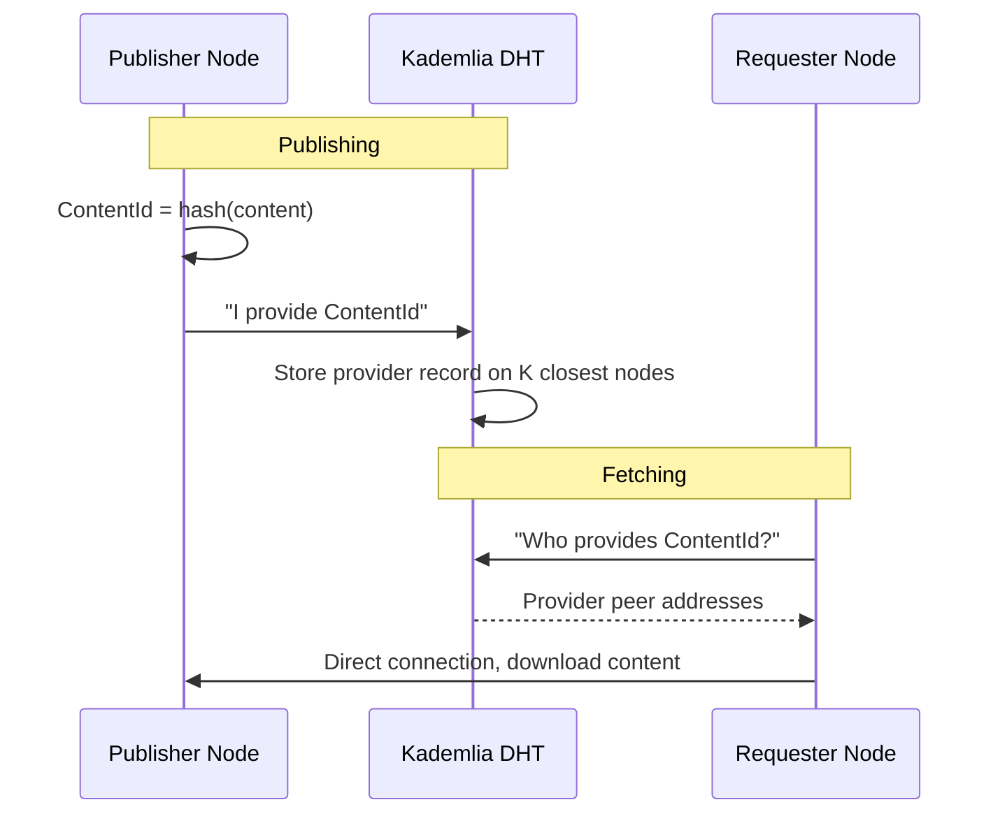
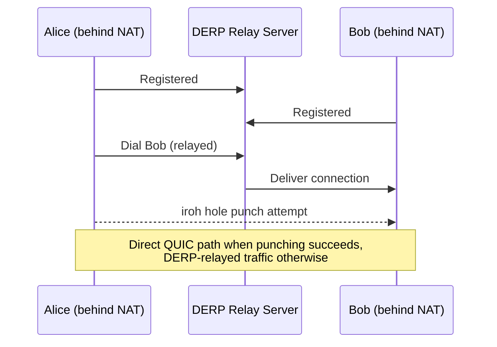
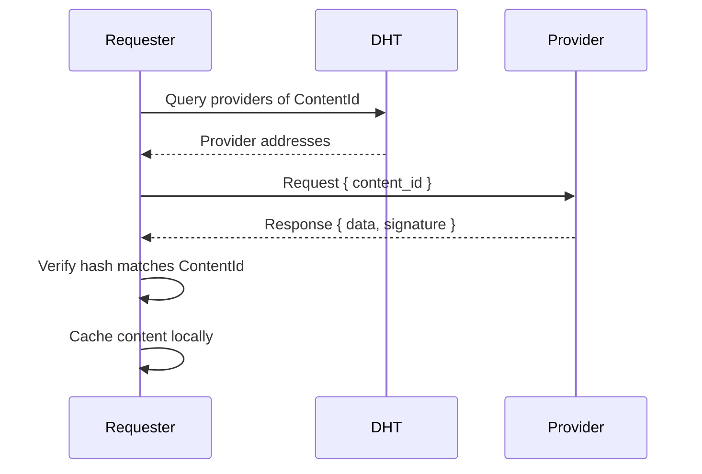
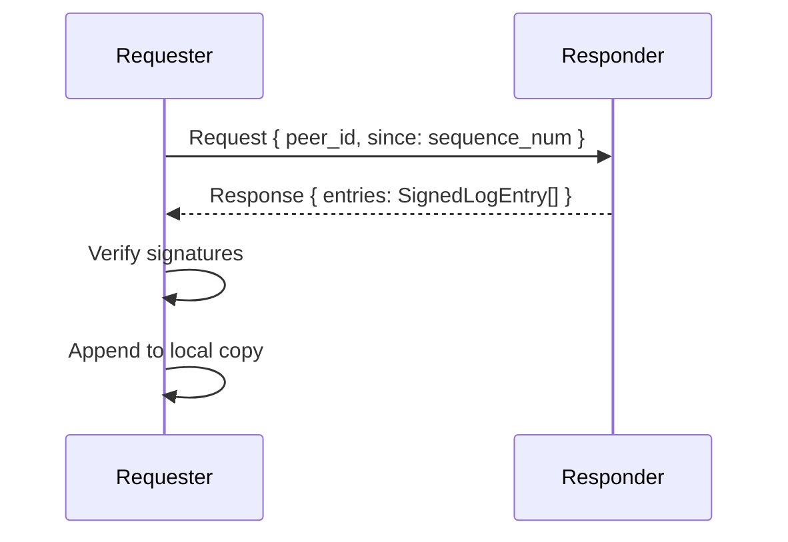

# Networking

## Overview

jolt networking is built on libp2p and iroh, providing peer discovery, content routing, NAT traversal, relays, and encrypted transport. The network has no required central server -- only user nodes and relay nodes.

Relays are ordinary jolt nodes with public reachability and extra responsibilities. They may help with discovery, NAT traversal, content pinning, and serving. They are replaceable carriers, not authorities over identity or content.

## Transport

The production transport is iroh, wired into libp2p (0.56) through a custom libp2p-iroh transport adapter. iroh provides QUIC connectivity plus DERP relay servers for NAT traversal, so jolt gets encrypted, multiplexed connections and automatic relay fallback from one stack.

| Transport | Use Case |
|---|---|
| iroh (QUIC + DERP relays) | Default and production transport. Fast, multiplexed, encrypted at transport layer, with built-in relay fallback and hole punching. |
| TCP + Noise + Yamux | Manual mode only (`--transport tcp`). Used for local demos and tests. An iroh node and a TCP node cannot interoperate. |

There is no WebSocket transport; browser-based light clients remain a future idea.

## Peer Discovery

### Bootstrap Nodes

On first launch, a node connects to a set of well-known bootstrap nodes to join the DHT. Bootstrap nodes are ordinary jolt nodes that are publicly reachable and have agreed to serve as entry points.

```
Built-in bootstrap relay (user-configurable):
  /ip4/167.233.106.111/udp/4001/quic-v1/p2p/12D3KooW...
```

The default `NetworkConfig` ships with no bootstrap peers; the daemon adds the built-in bootstrap relay at startup unless `--no-bootstrap` is passed.

Bootstrap nodes do not have special authority. They only help new nodes discover other peers. Anyone can run a bootstrap node.

Some relays may be discovery-only. A discovery relay helps nodes find peers and provider records, but does not accept content pinning.

### Kademlia DHT

The primary discovery and content routing mechanism. Every node participates in a Kademlia distributed hash table.

The DHT stores:
- **Provider records** -- "I have content with this ContentId"
- **Peer records** -- "This PeerId can be reached at these addresses"
- **Signed peer records** -- "This user's latest update log entry is X" (for mutable content resolution)



### mDNS (Local Network Discovery)

The mDNS behaviour is enabled by default, so nodes on the same LAN learn about each other via multicast DNS. However, on the default iroh transport this does not yet yield working LAN-only connectivity: mDNS advertises raw IP multiaddrs, and iroh nodes cannot dial those directly, so two local daemons on the default transport will not connect through mDNS alone. For local two-node demos, run both daemons with `--transport tcp` (optionally with `--no-bootstrap`), where mDNS discovery does work. Zero-configuration, offline LAN operation on the default transport remains a goal, not a shipped behavior.

### Relay Gossip

Implemented. Nodes gossip signed relay records and identity-head hints over
`/jolt/relays/1.0.0`:

- On connecting to a bootstrap or relay-mesh peer, a node announces the relay
  records it knows (bounded to 32 per exchange) and its fresh identity-head
  hints (bounded to 32), then requests the peer's records and hints back.
- Relay nodes additionally walk the relay mesh continuously: a periodic tick
  picks the next known relay round-robin, dials it if needed, and runs the
  same exchange, so the mesh converges without a coordinator.
- Records are signed by the relay identity, carry capabilities and an expiry
  (1 hour TTL), and invalid or oversized batches are rejected.

This is how a new node's relay address book grows beyond the built-in
bootstrap relay, and how relays learn which identities have fresh update-log
heads. See the `/jolt/relays/1.0.0` protocol section below.

### General Peer Exchange (PEX)

> Future design, not implemented in v0.

A general PEX mechanism (all peers exchanging lists of all known peers, not
just relay records) would further reduce reliance on bootstrap nodes. Today
only the relay gossip above exists.

## NAT Traversal

Most home and mobile networks use NAT, which prevents inbound connections. jolt still does QUIC hole punching; it is provided by iroh rather than by libp2p. Every node registers with a DERP relay server, dials go through the relay first, and iroh automatically attempts UDP hole punching to upgrade to a direct QUIC path. If hole punching fails, traffic continues to flow through the DERP relay.



Relayed connections are:
- Slower (extra hop)
- Still end-to-end encrypted (the DERP relay cannot read content)

Earlier versions of jolt ran on a plain libp2p QUIC transport with the libp2p NAT stack (AutoNAT detection, DCUtR hole punching, Circuit Relay v2). That stack was removed when the transport moved to iroh, which provides the same capabilities internally. None of those libp2p features are compiled in today, and the `enable_upnp` config flag is currently dead.

In addition to traffic relay, jolt uses the term relay for delegated availability. A user's home relay can pin that user's signed/encrypted content and announce provider records so the content remains reachable when the user's personal device is offline.

Traffic relay (DERP, part of iroh) and persistence relay (a jolt node with pinning) are separate concerns. A jolt relay node is about availability and discovery, not packet forwarding.

## Protocols

jolt defines custom libp2p protocols for different operations:

### `/jolt/content/1.0.0` -- Content Fetch

Request and serve content by ContentId.



### Relay Pinning (HTTP, not a libp2p protocol)

Request that a relay intentionally keep content available.

For v0, pinning is owner-directed: the user's node chooses relays and uploads content to them. Relays do not independently replicate durable copies to other relays.

Pinning does not run over a libp2p protocol. It happens over HTTP: clients POST signed pin requests to the relay's API (`POST /api/v1/relay/pins`), and the home-relay flow POSTs to the relay's advertised `api_url` the same way.

```
Request:  { owner: PeerId, content_id: ContentId, record_id: Option<ContentId>, signature: Signature }
Response: { accepted: bool, reason: Option<String> }
```

The signature proves that the owner requested this pin. A relay may reject a pin request for any local reason: capacity, policy, unknown user, invalid signature, or unsupported content.

### `/jolt/update-log/1.0.0` -- Update Log Sync

Synchronize a user's update log (for mutable content resolution).



### `/jolt/device-writer/1.0.0` -- Device Writer Log Sync

Synchronize per-device append-only writer logs for multi-writer identities. Each authorized device publishes its own signed append records; peers exchange and deterministically merge them. See [True Multi-Writer Identity and Devices](20-true-multi-writer-identity-and-devices.md).

### `/jolt/relays/1.0.0` -- Relay Gossip

Request/response exchange of signed relay records (relay identity,
capabilities, expiry) and identity-head hints. The messages are
`AnnounceRelays`, `AnnounceIdentityHeads`, `GetRelays { limit, capabilities }`,
`GetIdentityHeads { limit }`, and `FindIdentityProviders { query_id, identity,
limit, ttl, deadline_unix_ms }` (relay-forwarded identity provider queries,
used by the diagnostics in doc 17). Exchanges run on connection to bootstrap
and relay-mesh peers and during the relay mesh walk (see Relay Gossip above).
Batches are bounded, records are signature-verified before storage, and
expired records age out of the relay address book.

### Deferred App Protocols

Earlier app-platform sketches used names such as `/jolt/appsync/1.0.0` and
`/jolt/message/1.0.0` for app data sync and direct messaging:

```
Request:  { app_id: ContentId, sync_type: SyncType, payload: Vec<u8> }
Response: { payload: Vec<u8> }

SyncType:
  - FullSync: exchange all state
  - Delta: exchange changes since last sync
  - Custom: app-defined protocol
```

```
Request:  { to: PeerId, encrypted_payload: Vec<u8> }
Response: { status: Ack | Queued | Error }
```

Those are not current core protocol commitments. The current direction is in
[Bidirectional Communication and Signed Reachability](19-signed-reachability-endpoints.md):
Jolt should first provide signed reachability metadata and, if needed, generic
app-authorized opaque streams or bounded object ingress. App sync, inboxes,
messages, contacts, and conversation semantics stay above the protocol layer.

## Bandwidth Management

> Future design, not implemented in v0. The only shipped connection management today is an idle-connection timeout; the `[network]` config block below does not exist yet.

Nodes would have configurable limits to prevent abuse:

```toml
[network]
max_connections = 100
max_upload_bandwidth = "10MB/s"    # total upload cap
max_download_bandwidth = "50MB/s"  # total download cap
relay_bandwidth_limit = "1MB/s"    # if acting as relay
cache_serve_limit = "5MB/s"        # bandwidth for serving cached content
```

## Network Resilience

- **No single point of failure.** The DHT is distributed across all nodes.
- **Graceful degradation.** If most nodes go offline, remaining nodes still function.
- **Partition tolerance.** Disconnected clusters operate independently and merge when reconnected.
- **Eclipse attack resistance.** Kademlia's structure makes it difficult for a small number of malicious nodes to isolate a target.
