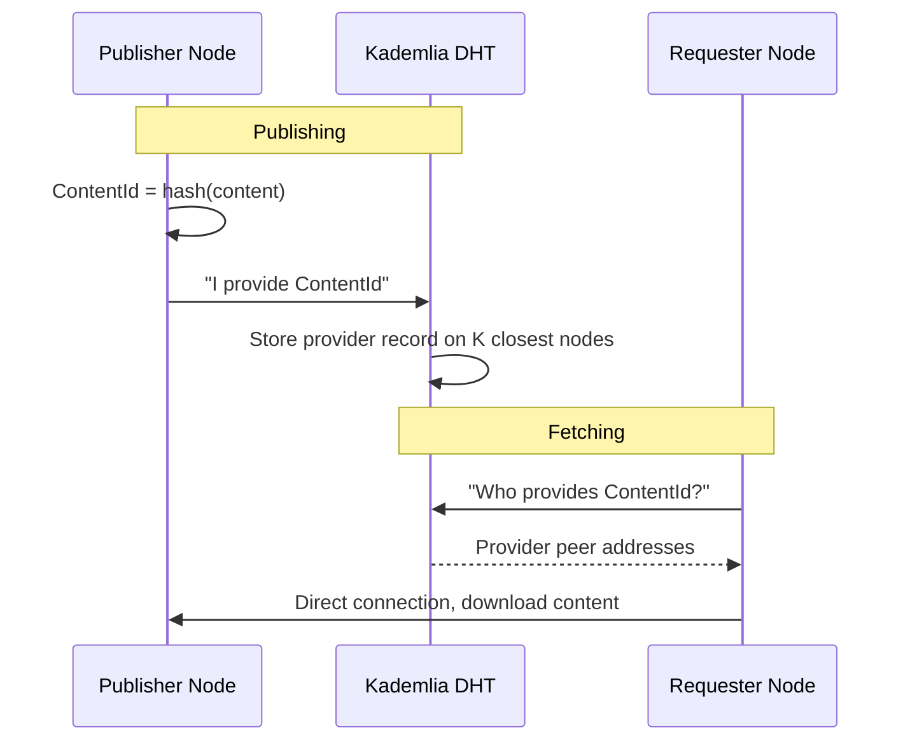
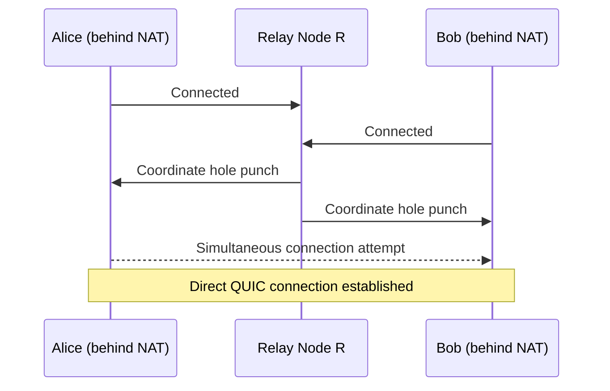
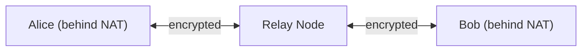
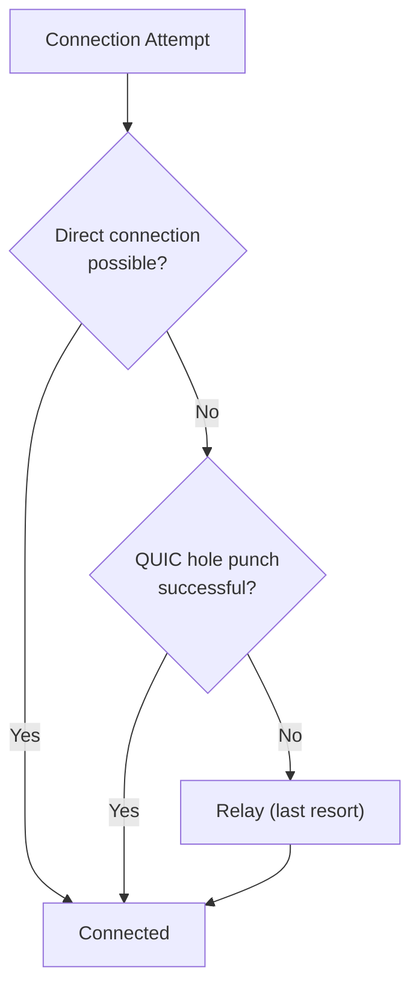
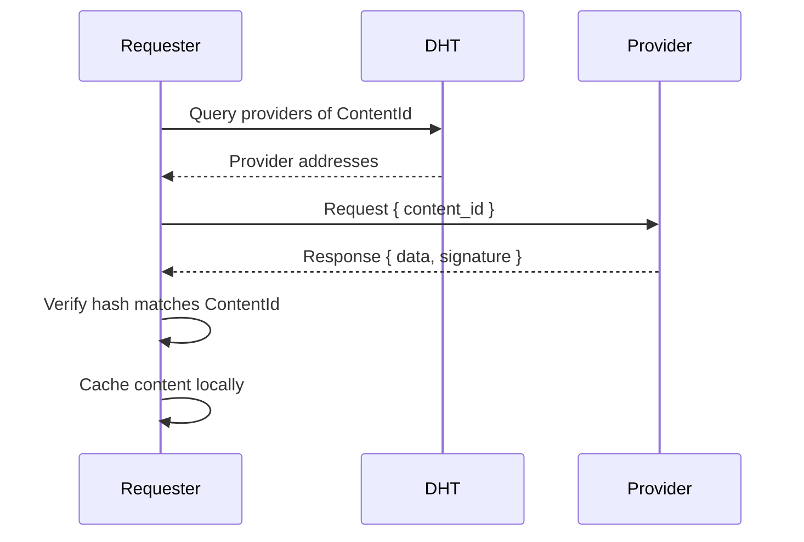
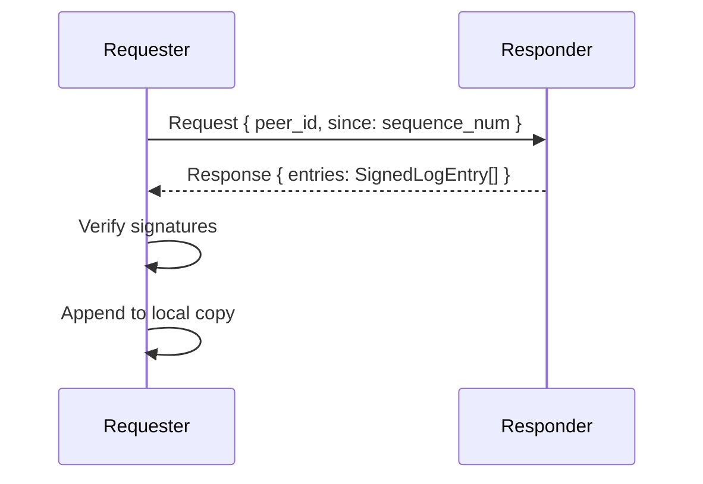

# Networking

## Overview

dweb networking is built on libp2p, providing peer discovery, content routing, NAT traversal, and encrypted transport. The network has no central servers -- only peer nodes.

## Transport

Nodes communicate over multiple transport protocols, selected based on capability:

| Transport | Use Case |
|---|---|
| QUIC | Primary transport. Fast, multiplexed, encrypted at transport layer. |
| TCP + Noise | Fallback when QUIC is unavailable. |
| WebSocket | For browser-based light clients (future). |

All transports use the Noise protocol for encryption and peer authentication.

## Peer Discovery

### Bootstrap Nodes

On first launch, a node connects to a set of well-known bootstrap nodes to join the DHT. Bootstrap nodes are ordinary dweb nodes that are publicly reachable and have agreed to serve as entry points.

```
Bootstrap list (hardcoded + user-configurable):
  /dns4/bootstrap1.dweb.network/tcp/4001/p2p/QmBootstrap1...
  /dns4/bootstrap2.dweb.network/tcp/4001/p2p/QmBootstrap2...
```

Bootstrap nodes do not have special authority. They only help new nodes discover other peers. Anyone can run a bootstrap node.

### Kademlia DHT

The primary discovery and content routing mechanism. Every node participates in a Kademlia distributed hash table.

The DHT stores:
- **Provider records** -- "I have content with this ContentId"
- **Peer records** -- "This PeerId can be reached at these addresses"
- **Signed peer records** -- "This user's latest update log entry is X" (for mutable content resolution)



### mDNS (Local Network Discovery)

Nodes on the same LAN discover each other automatically via multicast DNS. This enables:
- Zero-configuration local networking
- Fast transfers between devices on the same network
- Offline operation within a LAN (no internet needed)

### Peer Exchange (PEX)

Connected peers periodically exchange lists of known peers. This helps the network grow organically and reduces reliance on bootstrap nodes.

## NAT Traversal

Most home and mobile networks use NAT, which prevents inbound connections. dweb handles this with multiple strategies:

### 1. QUIC Hole Punching

libp2p's AutoNAT protocol detects whether a node is behind NAT. If so, it attempts UDP hole punching via a coordination relay.



### 2. Relay (Circuit Relay v2)

When hole punching fails, traffic can be relayed through a public node.



Relay is a fallback, not the default. Relayed connections are:
- Slower (extra hop)
- Limited in bandwidth (relays impose quotas)
- Still end-to-end encrypted (relay cannot read content)

### 3. UPnP / NAT-PMP

The node attempts to configure port forwarding on the router automatically. Works on many home networks without user intervention.

### Strategy Priority



## Protocols

dweb defines custom libp2p protocols for different operations:

### `/dweb/content/1.0.0` -- Content Fetch

Request and serve content by ContentId.



### `/dweb/updatelog/1.0.0` -- Update Log Sync

Synchronize a user's update log (for mutable content resolution).



### `/dweb/appsync/1.0.0` -- App Data Sync

Sync app-specific data between peers running the same app. This is the protocol apps use to exchange data (messages, posts, state).

```
Request:  { app_id: ContentId, sync_type: SyncType, payload: Vec<u8> }
Response: { payload: Vec<u8> }

SyncType:
  - FullSync: exchange all state
  - Delta: exchange changes since last sync
  - Custom: app-defined protocol
```

### `/dweb/message/1.0.0` -- Direct Messaging

Send encrypted messages between peers.

```
Request:  { to: PeerId, encrypted_payload: Vec<u8> }
Response: { status: Ack | Queued | Error }
```

## Bandwidth Management

Nodes have configurable limits to prevent abuse:

```toml
[network]
max_connections = 100
max_upload_bandwidth = "10MB/s"    # total upload cap
max_download_bandwidth = "50MB/s"  # total download cap
relay_bandwidth_limit = "1MB/s"    # if acting as relay
cache_serve_limit = "5MB/s"        # bandwidth for serving cached content
```

## Network Resilience

- **No single point of failure.** The DHT is distributed across all nodes.
- **Graceful degradation.** If most nodes go offline, remaining nodes still function.
- **Partition tolerance.** Disconnected clusters operate independently and merge when reconnected.
- **Eclipse attack resistance.** Kademlia's structure makes it difficult for a small number of malicious nodes to isolate a target.
