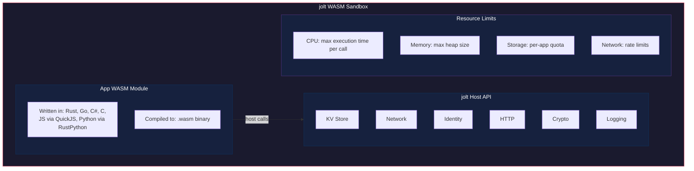
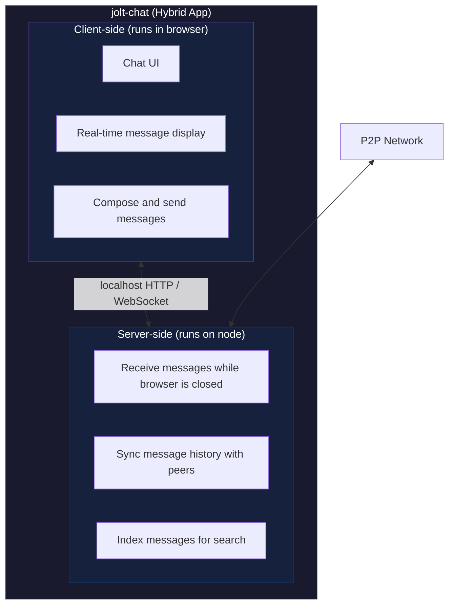

# WASM Runtime

> **Status: abandoned.** This document describes an early design direction
> that Jolt no longer pursues. Nothing in it is implemented, and none of it is
> planned. The application model that was actually built is external apps
> talking to the local daemon through capability-scoped sessions; see
> [App Boundary and Sessions](15-app-boundary-and-sessions.md). The capability
> vocabulary below (`storage`, `network`, `crypto`, ...) is incompatible with
> and superseded by the implemented grammar in doc 15. The document is
> retained for historical context only.

## Overview

jolt runs applications as WebAssembly (WASM) modules in a sandboxed environment powered by wasmtime. Apps have zero access to the host system by default and interact with jolt exclusively through a capability-gated host API.

## Execution Model



## App Types

### Client-Side Apps

Run in the user's browser. The WASM binary and assets (HTML, CSS, JS) are served to the browser by the local jolt node. The app executes entirely in the browser's WASM runtime.

- No server-side execution needed
- Data syncs P2P between users via the jolt network layer
- Most apps should target this model
- Cached and available even when the original publisher is offline

### Server-Side Apps

Run on the user's jolt node in the wasmtime sandbox. Used for:
- Background processing (indexing, syncing)
- Serving dynamic content to the local browser
- Tasks requiring persistent execution (not just when the browser is open)

### Hybrid Apps

Combine both: a client-side UI with a server-side background process.



## Host API

The host API is the set of functions jolt exposes to WASM apps. Each function is gated behind a capability -- the app must have been granted the capability at install time to use it.

### Storage API

Capability: `storage`

```
// Key-value store, isolated per app
fn kv_get(key: &[u8]) -> Option<Vec<u8>>
fn kv_set(key: &[u8], value: &[u8])
fn kv_delete(key: &[u8])
fn kv_list_keys(prefix: &[u8]) -> Vec<Vec<u8>>
fn kv_has(key: &[u8]) -> bool

// Blob storage for larger objects
fn blob_store(data: &[u8]) -> ContentId
fn blob_get(id: &ContentId) -> Option<Vec<u8>>
fn blob_delete(id: &ContentId)
```

### Network API

Capability: `network`

```
// P2P messaging with other users running the same app
fn peer_send(peer: &PeerId, message: &[u8]) -> Result<(), Error>
fn peer_broadcast(message: &[u8])  // send to all connected peers with this app
fn peer_list() -> Vec<PeerId>      // peers currently online with this app

// Subscribe to incoming messages
fn on_peer_message(callback: fn(peer: PeerId, message: &[u8]))
```

### HTTP API

Capability: `http`

```
// Make outbound HTTP requests (to external web, rate-limited)
fn http_request(request: HttpRequest) -> HttpResponse

struct HttpRequest {
    method: Method,
    url: String,
    headers: Vec<(String, String)>,
    body: Option<Vec<u8>>,
}
```

### Identity API

Capability: `identity`

```
// Read-only access to identity information
fn self_peer_id() -> PeerId          // this node's peer ID
fn self_public_key() -> PublicKey     // this node's public key
fn self_display_name() -> String     // user's configured display name

// Sign data with the node's identity (requires elevated 'sign' capability)
fn sign(data: &[u8]) -> Signature
fn verify(peer: &PeerId, data: &[u8], signature: &Signature) -> bool
```

### Crypto API

Capability: `crypto`

```
// Encrypt/decrypt for specific recipients
fn encrypt_for(recipient: &PublicKey, plaintext: &[u8]) -> Vec<u8>
fn decrypt(ciphertext: &[u8]) -> Result<Vec<u8>, Error>

// Symmetric encryption (app-managed keys)
fn symmetric_encrypt(key: &[u8], plaintext: &[u8]) -> Vec<u8>
fn symmetric_decrypt(key: &[u8], ciphertext: &[u8]) -> Result<Vec<u8>, Error>

// Random bytes
fn random_bytes(len: usize) -> Vec<u8>
```

### Content API

Capability: `content`

```
// Publish content to the network
fn content_publish(data: &[u8], visibility: Visibility) -> ContentId
fn content_fetch(id: &ContentId) -> Option<Vec<u8>>
fn content_pin(id: &ContentId)    // keep in local cache permanently
fn content_unpin(id: &ContentId)
```

### Logging API

Capability: always granted (no gate)

```
fn log_debug(message: &str)
fn log_info(message: &str)
fn log_warn(message: &str)
fn log_error(message: &str)
```

## Permissions Model

Apps declare required and optional capabilities in their manifest:

```toml
[app]
name = "jolt-chat"
version = "1.0.0"
developer = "ed25519:a1b2c3d4..."

[capabilities.required]
storage = true
network = true

[capabilities.optional]
identity = "Read-only access to display name for chat"
crypto = "End-to-end encryption of messages"

[capabilities.never]
http = true  # this app does not need external HTTP access
```

At install time, the user sees:

```
Installing jolt-chat v1.0.0
Developer: alice (ed25519:a1b2c3...)

Required permissions:
  [x] Local storage
  [x] P2P networking

Optional permissions:
  [ ] Read your display name
  [ ] Encrypt/decrypt messages

This app will NEVER access:
  External HTTP requests

[Install]  [Cancel]
```

## Resource Limits

Each app runs under configurable resource constraints:

```toml
[runtime.limits]
max_memory = "64MB"           # WASM heap size limit
max_cpu_time = "100ms"        # per invocation (request/message handler)
max_storage = "100MB"         # per-app KV + blob storage
max_network_rate = "1MB/s"    # P2P message throughput
max_concurrent_requests = 10  # parallel outbound connections
```

Exceeding a limit results in the operation being terminated or rejected, not the app being killed. The app receives an error it can handle gracefully.

## Language Support

WASM is the compilation target. Developers can write apps in any language that compiles to WASM:

| Language | Toolchain | Notes |
|---|---|---|
| Rust | `cargo build --target wasm32-wasip1` | Best support, smallest binaries |
| C/C++ | wasi-sdk | Mature, well-tested |
| Go | TinyGo | Good, standard Go produces large binaries |
| C# / .NET | NativeAOT-LLVM | Improving rapidly |
| JavaScript | QuickJS compiled to WASM | Bundle QuickJS runtime + user code |
| Python | RustPython or CPython-WASM | Heavier, experimental |

jolt will provide SDK crates/packages for popular languages that wrap the host API into idiomatic bindings:

```
jolt-sdk-rust     # Rust crate
jolt-sdk-js       # npm package (for QuickJS target)
jolt-sdk-go       # Go module (for TinyGo target)
jolt-sdk-dotnet   # NuGet package
```

## App Isolation

Each installed app runs in its own WASM instance with:
- Separate memory space (cannot access another app's memory)
- Separate storage namespace (cannot read another app's KV store)
- Separate network identity (messages tagged with app ID)
- No filesystem access (all storage goes through the host API)
- No raw network access (all networking goes through the host API)

An app cannot:
- Read or modify another app's data
- Access the host filesystem
- Open raw network sockets
- Execute host system commands
- Access hardware directly
