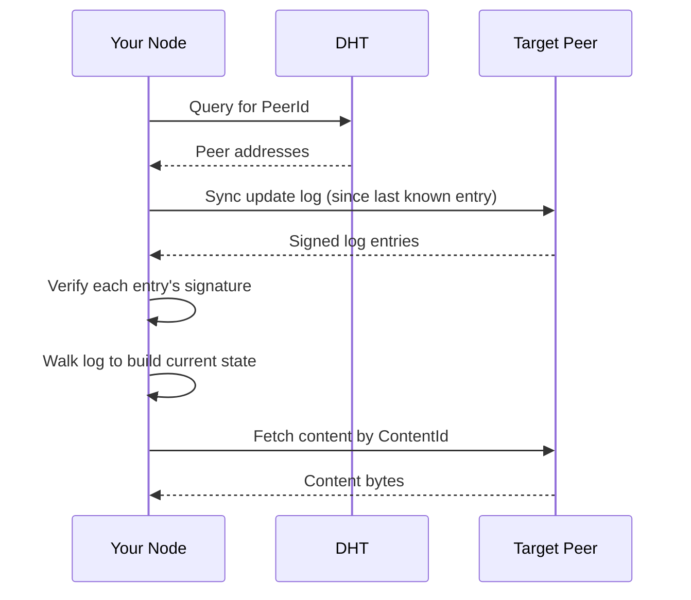
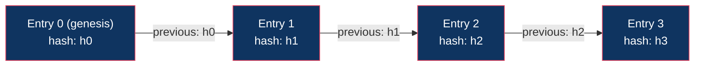

# Data Model

## Principles

1. **Data belongs to its owner.** Your data lives on your node. Period.
2. **Apps don't own data.** An app is code that operates on your data. Uninstall the app, keep the data.
3. **Apps are isolated.** Each app has its own data namespace. App A cannot read App B's data.
4. **Public content is cacheable.** Other nodes may cache your public content for availability.
5. **Private data never leaves your node unencrypted.** Encrypted backups are opt-in only.

## Data Categories

### 1. App Data (Private by Default)

Data created by an app during use. Stored in a per-app isolated namespace on the user's node.

```
~/.dweb/data/
  apps/
    <app-content-id>/
      kv/           # key-value store (sled/sqlite)
      blobs/        # larger binary objects
      meta.json     # app metadata, permissions granted
```

Examples:
- Chat messages in a messaging app
- Notes in a notes app
- Settings and preferences
- Draft content

This data:
- Is only accessible to the app that created it
- Never leaves the node unless the user explicitly shares it
- Persists across app updates
- Can be exported or deleted by the user at any time

### 2. Published Content (Public)

Content the user has explicitly published to the network. Content-addressed and signed.

```
~/.dweb/data/
  published/
    <content-id>/
      content       # the actual bytes
      manifest      # metadata (type, size, signature)
```

Examples:
- Blog posts
- Videos
- Music
- Public profile information

This content:
- Is content-addressed (immutable at a given ContentId)
- Is signed by the publisher's key
- Can be cached by any node that fetches it
- Is served to the network via the content fetch protocol

### 3. Cached Content (From Other Nodes)

Content fetched from other nodes and cached locally for performance and availability.

```
~/.dweb/data/
  cache/
    <content-id>/
      content
      manifest
      fetched_at    # timestamp
      last_accessed # for LRU eviction
```

This content:
- Is verified against its ContentId on fetch
- Is evicted under LRU policy when cache is full
- Can be pinned to prevent eviction
- Is served to other nodes who request it (helping availability)

### 4. Installed Apps

WASM binaries and assets for installed applications.

```
~/.dweb/data/
  installed_apps/
    <app-content-id>/
      app.wasm          # the WASM binary
      assets/           # HTML, CSS, JS, images
      manifest.toml     # app manifest
      permissions.toml  # granted permissions
      version           # installed version
```

## Content Addressing

Every piece of published content has a unique identifier derived from its hash.

```rust
struct ContentId {
    hash: [u8; 32],          // BLAKE3 hash of content bytes
    codec: Codec,            // how to interpret the content
}

enum Codec {
    Raw,        // raw bytes
    DagCbor,    // structured data (CBOR-encoded DAG)
    Html,       // HTML document
    Wasm,       // WASM binary
}
```

Content is immutable at a given ContentId. Updating content means publishing new content with a new ContentId and updating the user's update log to point to it.

## Update Log

Each user maintains a signed append-only log that tracks changes to their published content. This is how mutable state works in a content-addressed system.

```rust
struct UpdateLogEntry {
    sequence: u64,              // monotonically increasing
    timestamp: u64,             // unix timestamp
    action: Action,
    previous: Option<ContentId>,// hash of previous entry (chain integrity)
    signature: Signature,       // signed by the user's key
}

enum Action {
    // Site / content management
    PublishContent {
        path: String,           // logical path, e.g. "/blog/hello-world"
        content_id: ContentId,
    },
    RemoveContent {
        path: String,
    },
    UpdateRoot {
        content_id: ContentId,  // new root manifest for user's published content
    },

    // App-related
    PublishApp {
        app_manifest: ContentId,
    },
    UpdateApp {
        app_id: ContentId,      // original app ID
        new_version: ContentId, // new version's content ID
    },

    // Profile
    UpdateProfile {
        display_name: Option<String>,
        bio: Option<String>,
        avatar: Option<ContentId>,
    },
}
```

### Resolving Mutable Content

To find a user's latest published content:



### Log Integrity

Each entry references the previous entry's hash, forming a hash chain. This prevents:
- Entries being inserted or removed
- Log history being rewritten
- Ordering being manipulated



Tampering with entry 1 would change h1, which would invalidate entry 2's chain.

## Per-App Data Isolation

The data store enforces strict isolation between apps:

```rust
struct AppDataStore {
    app_id: ContentId,     // which app this store belongs to
    db: Database,          // isolated database instance
}

impl AppDataStore {
    // All operations are scoped to this app's namespace
    fn get(&self, key: &[u8]) -> Option<Vec<u8>>;
    fn set(&self, key: &[u8], value: &[u8]);
    fn delete(&self, key: &[u8]);
    fn list_keys(&self, prefix: &[u8]) -> Vec<Vec<u8>>;
}
```

The runtime enforces that WASM app A can never obtain a handle to app B's data store.

## Data Export and Portability

Users can export their data at any time:

```
dweb export --app dweb-chat --format json > my-chat-history.json
dweb export --all --format tar > my-dweb-data.tar
```

This is a core principle: your data is never trapped. You can:
- Export any app's data in standard formats
- Back up your entire node
- Migrate to a new machine
- Delete everything

## Storage Quotas

```toml
[storage]
total_limit = "10GB"          # total disk usage for dweb
cache_limit = "2GB"           # max cached content from other nodes
per_app_limit = "500MB"       # max data per installed app
published_limit = "5GB"       # max published content
```

When limits are reached:
- Cache: LRU eviction (least recently accessed content is removed first)
- App data: app receives a storage error, user is notified
- Published content: user must remove content before publishing more

## Redundancy and Backup

### Peer Pinning

Users can ask trusted peers to pin their published content:

```
dweb pin request --peer <peer-id> --content <content-id>
```

The pinning peer stores a copy and serves it to the network. Mutual pinning arrangements ("I pin yours, you pin mine") improve availability for both parties.

### Redundancy Groups

A group of nodes that agree to keep each other's content available.

```rust
struct RedundancyGroup {
    members: Vec<PeerId>,
    policy: RedundancyPolicy,
}

struct RedundancyPolicy {
    replicas: usize,          // how many copies to maintain
    content_types: Vec<Codec>,// what to replicate (all, or specific types)
    max_storage: u64,         // per-member storage contribution
}
```

### Encrypted Backup

Users can opt into encrypted backup of private app data to their redundancy group:

```
1. User enables encrypted backup for an app
2. App data is encrypted with user's key
3. Encrypted blob is distributed to redundancy group members
4. Members store but cannot read the encrypted data
5. User can restore from any member if their node is lost
```

This is strictly opt-in. By default, private data never leaves the user's node.
