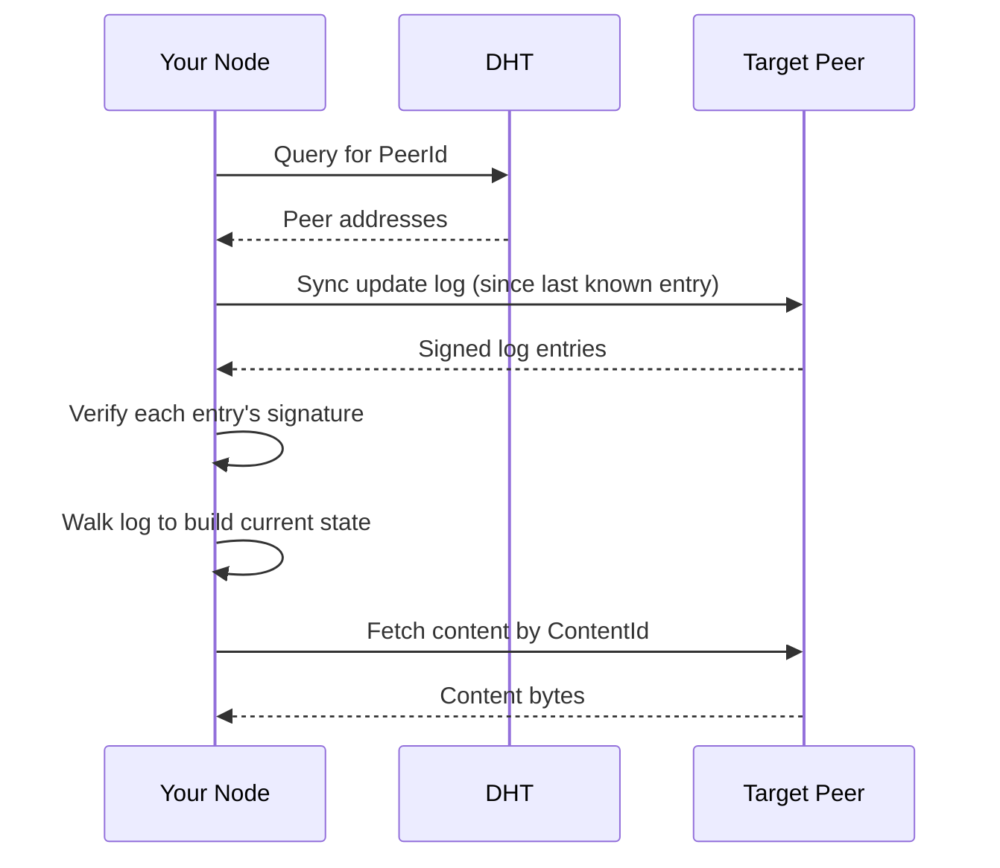
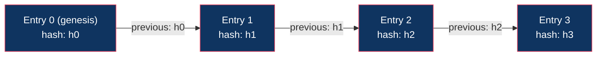

# Data Model

## Principles

1. **Data belongs to its owner.** Your keys and signed records define ownership. Nodes and relays may hold copies, but they are not the authority.
2. **Apps don't own data.** An app is code that operates on your data. Uninstall the app, keep the data.
3. **Apps are isolated.** Each app has its own data namespace. App A cannot read App B's data.
4. **Public content is cacheable.** Other nodes may cache your public content for availability.
5. **Private data never leaves your node unencrypted.** Relays and caches may carry ciphertext without being able to read it.
6. **The protocol is application-agnostic.** Profiles, feeds, galleries, games, timelines, and lenses are data above the protocol, not protocol primitives.

## Data Categories

### 1. Published Content (Public)

Content the user has explicitly published to the network. Content-addressed and signed.

```
~/.jolt/data/
  published/
    <content-id>/
      content         # the actual bytes
      manifest.json   # metadata (type, size, publisher key, signature)
```

Examples:
- Blog posts
- Videos
- Music
- Public profile information

This content:
- Is content-addressed (immutable at a given ContentId)
- Is signed by the publisher's key
- Can be cached by any node that fetches it
- Is served to the network via the content fetch protocol
- Can be pinned by a home relay at the owner's request

### 2. Cached Content (From Other Nodes)

Content fetched from other nodes and cached locally for performance and availability.

```
~/.jolt/data/
  cache/
    <content-id>/
      content
      manifest.json
    cache_index.json  # per-entry cached_at, last_accessed, pinned, size (for LRU eviction)
```

This content:
- Is verified against its ContentId on fetch
- Is evicted under LRU policy when cache is full
- Can be pinned to prevent eviction
- Is served to other nodes who request it (helping availability)

## Content Addressing

Every piece of published content has a unique identifier derived from its hash.

```rust
struct ContentId(Cid);   // CIDv1 wrapping a BLAKE3-256 multihash of the content bytes
```

The codec is always RAW (`0x55`); content type lives in the manifest, not the identifier. A ContentId serializes as its CID string (e.g. `bafk...`).

Content is immutable at a given ContentId. Updating content means publishing new content with a new ContentId and updating the user's update log to point to it.

## Update Log

> Design update: the next identity model replaces the single global user update
> log with per-device writer logs and deterministic merged identity state. See
> [True Multi-Writer Identity and Devices](20-true-multi-writer-identity-and-devices.md).
> The structure below describes the current v0 single-writer model.

Each user maintains a signed append-only log that tracks changes to their published content. This is how mutable state works in a content-addressed system.

```rust
struct UpdateLogEntry {
    body: UpdateLogEntryBody,
    signature: Vec<u8>,         // signature over the body, by the user's key
}

struct UpdateLogEntryBody {
    owner_public_key: Vec<u8>,
    sequence: u64,              // monotonically increasing
    previous_entry_hash: Option<UpdateLogEntryHash>, // BLAKE3 hash of previous entry body
    action: UpdateAction,
}

enum UpdateAction {
    // Site / content management
    PublishContent {
        content_id: ContentId,
    },
    UpdateRoot {
        content_id: ContentId,  // new root for user's published content
    },
    SetPath {
        path: String,           // logical path, e.g. "/blog/hello-world"
        content_id: ContentId,
    },
    RemovePath {
        path: String,
    },

    // Profile
    UpdateProfile {
        profile: UpdateProfile, // display_name, bio, avatar
    },

    // Reachability
    SetReachability {
        relays: Vec<RelayHint>,
    },
}
```

Entries carry no timestamp; ordering comes from the sequence number and hash chain.

### Resolving Mutable Content

To find a user's latest published content:



### Log Integrity

Each entry references the previous entry's hash, forming a hash chain. This prevents:
- Entries being inserted or removed
- Log history being rewritten
- Ordering being manipulated



Tampering with entry 1 would change h1, which would invalidate entry 2's chain.

## Device-Writer Logs and Append Records

Alongside the last-writer-wins update log, each device keeps its own signed, hash-chained device-writer log. Its operations are `DeviceWriterOperation::SetPath { path, content_id, mode }`, where the mode is:

- `Singleton` -- the path holds one value; later entries replace earlier ones (conflicts across devices are surfaced, not silently merged)
- `Append` -- every entry is retained; readers enumerate all append records under a path prefix (e.g. all posts under `/feed/`)

Device logs from all of an identity's authorized devices merge deterministically into a `MergedDeviceIdentityState`. Append records live only in device-writer logs; they are never written to the last-writer-wins update log. On disk they persist separately, in `device_writer_logs/`, as the verified device-authority records plus the local device's log, and peers sync and enumerate them over the device-writer protocol.

See [True Multi-Writer Identity and Devices](20-true-multi-writer-identity-and-devices.md) for the full model.

## Storage Quotas

The only implemented limit is the cache size: `CacheConfig.max_size_bytes`, defaulting to 2 GB. When the cache is full, LRU eviction removes the least recently accessed non-pinned content first.

## Redundancy and Backup

### Relay Pinning

Users can delegate availability to a relay. The relay pins owner-requested content and announces itself as a provider. The relay is replaceable and does not become the authority for the content.

For v0, replication is owner-directed:

```
owner node -> selected relay(s)
```

Relays should not create durable relay-to-relay copies unless the owner explicitly authorizes mirroring in a future protocol version.

### Peer Pinning

Users can ask trusted peers to pin their published content:

```
jolt pin request --peer <peer-id> --content <content-id>
```

The pinning peer stores a copy and serves it to the network. Mutual pinning arrangements ("I pin yours, you pin mine") improve availability for both parties.
