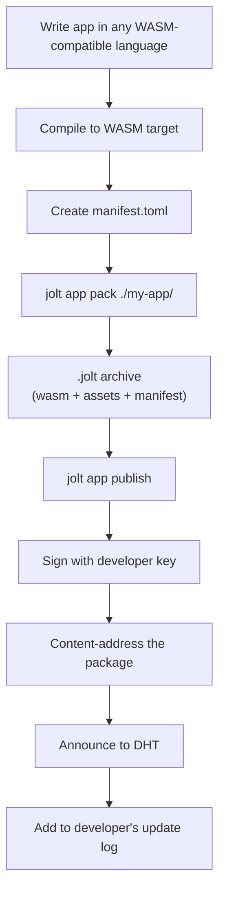
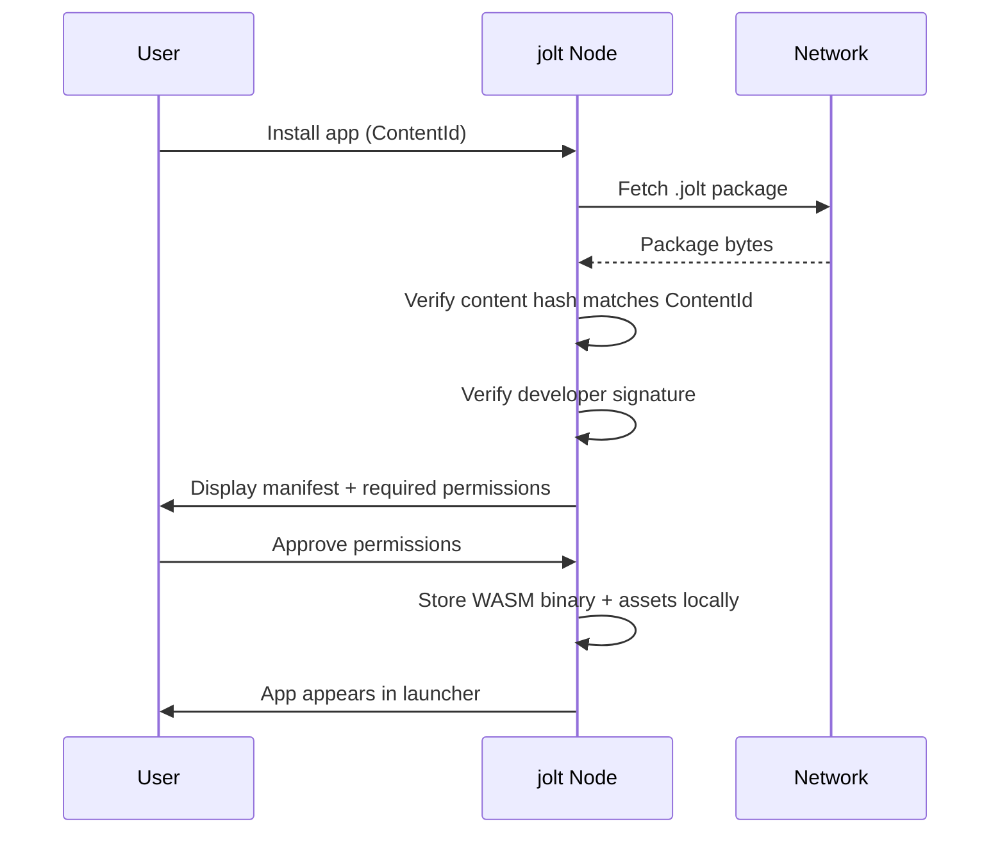
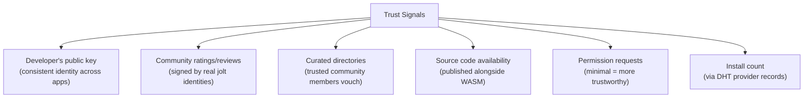

# Application System

## Overview

Jolt apps are portable interfaces for Jolt spaces.

The protocol owns the hard parts: identity, signed state, content addressing, access control, relays, provider discovery, and peer caching. Apps sit above that substrate and give a space a useful experience.

Examples:

- A game community app renders releases, mods, announcements, lobbies, and matchmaking.
- A creator app renders member feeds, media, comments, and recommendations.
- A research app renders datasets, notebooks, citations, and usage rights.
- A legal workspace app renders documents, signatures, versions, and evidence graphs.

WASM is useful because it lets a space carry or reference its preferred interface without forcing everyone through a central SaaS backend. But WASM is not the core product, and it should not be the first application proof. The core product is owned community state that any authorized client can verify.

Apps are distributed software packages. A developer compiles an app to WASM, publishes it to the Jolt network, and users install it on their nodes. Apps run locally, store data in scoped local namespaces, and communicate with other users peer-to-peer through node capabilities.

## Near-Term App Boundary

The first real app proof is not the WASM runtime. Pastey proved a nearer boundary:

```text
external app -> local Jolt daemon -> Jolt network
```

In this model, the daemon is the local authority for identities, keys, settings, content, and network access. Apps are untrusted clients that request scoped sessions. Jolt Console is the privileged local control surface where the user approves and revokes app grants.

The session model is defined in [App Boundary and Sessions](15-app-boundary-and-sessions.md). The WASM/runtime material below remains a longer-term direction, not the immediate implementation path.

## Role in the Stack

```text
Jolt Protocol
  identity, CIDs, update logs, encryption, relays, access

Jolt Space
  signed community state: members, feeds, content refs, permissions

Jolt App
  renderer/editor/tool for a kind of space
```

The app should receive capability-limited access to the space. It should not become the authority over the space.

## Protocol Boundary

Apps and lenses sit above the protocol. The protocol should stay pure and durable: identity, CIDs, signed update logs, provider discovery, content fetch, relays, pinning, encryption/access grants, capability records, schema references, and generic signed paths.

The protocol must not hardcode application concepts such as profiles, feeds, posts, galleries, games, timelines, or lens runtimes. Those are signed content and schemas interpreted by clients.

```text
Protocol:
  identity X maps path /gallery to CID Y at sequence N

Application/lens:
  CID Y is a gallery manifest and this renderer knows how to use it
```

This keeps Jolt closer to the web's layering discipline: the lower layer moves verifiable state and addressing, while higher layers decide what experiences to build from it.

## Exploratory: Spaces and Lenses

An emerging framing is:

```text
Space = owned signed object graph
Object = signed/encrypted content or state unit
Lens = executable or built-in perspective over a space
```

In this framing, the space is the durable place. Lenses are interchangeable ways to inspect, render, edit, or transform that place. A creator could recommend a gallery lens, while a visitor could choose a low-bandwidth lens, accessibility lens, timeline lens, object explorer, or debug lens.

This is a useful north star, but it is not yet a committed runtime design. Executable lenses introduce hard problems: sandboxing, capabilities, malicious code, schema evolution, GPU/audio access, local storage, app updates, trust, and revocation.

Before building a WASM runtime, Jolt should prove a smaller application layer:

```text
identity.jolt path
  -> signed space manifest or HTML view
  -> built-in client/dashboard renderer
  -> fetches verified content through existing APIs
```

That demo should use the existing protocol primitives without adding profile/feed/gallery concepts to the protocol layer. It can be implemented as a built-in lens in the local dashboard or client: enough to show that a Jolt space can be experienced as more than a file list, without treating WASM as a prerequisite.

## HTML as a Space View

HTML remains a valid interface format for browsing a space.

The important distinction is:

```text
Signed space state = authority
HTML = view
```

A space may publish a generated HTML tree for easy browsing, linking, and media layout. A client should still verify the signed records and content IDs that produced the view. This gives Jolt a familiar browseable surface without reducing the protocol to "web pages on P2P".

## App Manifest

Every app has a manifest that describes it:

```toml
[app]
id = "bafk..."                          # ContentId of the initial version
name = "jolt-community"
description = "Community space interface"
version = "1.0.0"
developer = "ed25519:a1b2c3d4..."       # developer's public key
homepage = "jolt://a1b2c3d4/apps/community"  # optional
license = "MIT"

[app.type]
kind = "hybrid"                         # "client" | "server" | "hybrid"

[app.client]
entry = "index.html"                    # entry point for browser UI
wasm = "app_client.wasm"               # client-side WASM (optional)
assets = ["styles.css", "app.js"]      # static assets

[app.server]
wasm = "app_server.wasm"               # server-side WASM binary
entry_function = "handle_request"       # exported function name

[capabilities.required]
storage = true
network = true

[capabilities.optional]
identity = "Display your name in chat"
crypto = "End-to-end message encryption"

[capabilities.never]
http = true

[resources]
max_memory = "32MB"
max_storage = "50MB"
```

## App Lifecycle

### Publishing



### Discovery

Users find apps through:

1. **Space preference** -- a space's signed state can reference a preferred app.
2. **Direct link** -- a `jolt://` URI shared by someone.
3. **Developer's profile** -- browse a developer's published apps.
4. **Community recommendation** -- spaces can recommend apps for their members.
5. **Curated directories** -- community-maintained app lists, themselves published through Jolt.

There is no centralized app store. Discovery can be decentralized and community-curated, but v0 should not require global app search.

### Installation



### Running

**Client-side apps:**
```
1. User clicks app in launcher
2. Node serves app assets via localhost HTTP
3. Browser loads HTML + WASM
4. App runs entirely in the browser
5. Communicates with node via localhost API for storage/network
```

**Server-side apps:**
```
1. App starts in wasmtime sandbox on the node
2. Runs in background, handles events (incoming messages, scheduled tasks)
3. Exposes HTTP endpoints proxied through the node's server
4. Browser UI communicates with server-side WASM via these endpoints
```

**Hybrid apps:**
```
1. Server-side component starts on node (background processing)
2. Client-side component loaded in browser (UI)
3. Browser talks to server component via localhost HTTP
4. Server component handles P2P sync, caching, background tasks
5. Client component handles UI, real-time updates via WebSocket
```

### Updating

```
1. Node periodically checks developer's update log for new versions
   (configurable: auto-check, manual, or disabled)
2. New version found:
   - Fetch new package
   - Verify developer signature (same key as original publish)
   - Show user: changelog, permission changes
   - If new permissions required, user must approve
3. User accepts: old WASM replaced, data preserved
4. User declines: stays on current version
5. Auto-update option for trusted developers
```

### Uninstalling

```
1. User clicks "Uninstall" (or: jolt app uninstall <app-id>)
2. WASM binary and assets deleted
3. User chooses: keep data or delete data
4. If keep: data remains in per-app namespace, accessible if reinstalled
5. If delete: all app data removed permanently
```

## App-to-App Communication

Apps on the same node can communicate through a controlled message bus:

```rust
// App A wants to share data with App B
// Both apps must declare this capability and the user must approve

fn app_send(target_app: &ContentId, message: &[u8]) -> Result<(), Error>
fn on_app_message(callback: fn(source_app: ContentId, message: &[u8]))
```

Use cases:
- A file picker app that other apps can invoke
- A contacts app that shares contact info with chat apps
- A media library app that shares selected files with publishing apps

The user explicitly grants inter-app communication permissions.

## Developer SDK

jolt provides SDK packages that wrap the host API:

### Rust SDK Example

```rust
use jolt_sdk::prelude::*;

#[jolt::main]
async fn handle_request(req: Request) -> Response {
    // Read from app's KV store
    let count: u64 = kv::get("visit_count").unwrap_or(0);
    kv::set("visit_count", count + 1);

    // Get visitor identity
    let visitor = identity::self_peer_id();

    Response::html(format!(
        "<h1>Welcome to my app!</h1>
         <p>You are: {}</p>
         <p>Visit count: {}</p>",
        visitor, count
    ))
}
```

### JavaScript SDK Example

```javascript
import { kv, network, identity } from 'jolt-sdk';

// Handle incoming chat messages
network.onPeerMessage(async (peer, data) => {
    const message = JSON.parse(data);
    const messages = await kv.get('messages') || [];
    messages.push({ from: peer, text: message.text, time: Date.now() });
    await kv.set('messages', messages);
});

// Send a message
export async function sendMessage(peerId, text) {
    await network.peerSend(peerId, JSON.stringify({ text }));
}
```

## App Signing and Trust

### Developer Identity

Apps are signed with the developer's Ed25519 key. This provides:
- **Authenticity** -- proof the app came from the claimed developer
- **Update integrity** -- only the original developer can publish updates
- **Accountability** -- malicious apps can be traced to a key

### Trust Model

jolt does not have a central review process. Trust is distributed:



### Malicious App Protection

- WASM sandbox prevents access to host system
- Capability system limits what apps can do
- Resource limits prevent resource exhaustion
- Users can revoke permissions or uninstall at any time
- Community can flag malicious apps in curated directories
- No app can escalate its own privileges

## Example Apps

### jolt-blog (Client-Side)
A blogging platform. Write posts in markdown, publish to the network. Readers subscribe to your update log. Client-side rendering, no server component needed.

### jolt-chat (Hybrid)
Encrypted peer-to-peer messaging. Server component receives messages when browser is closed and syncs history. Client component provides the chat UI.

### jolt-video (Client-Side)
Publish and stream video. Videos are chunked and content-addressed. Viewers stream from multiple peers simultaneously (swarm). Subscriptions via update logs.

### jolt-forum (Hybrid)
Discussion boards. Topics and replies stored per-user. Server component indexes and aggregates across peers for search. Moderation by community-elected keys.
