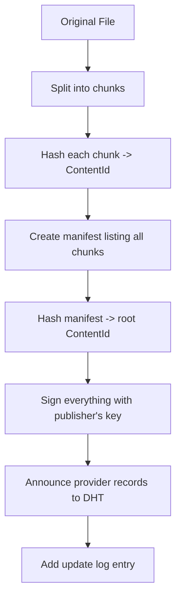
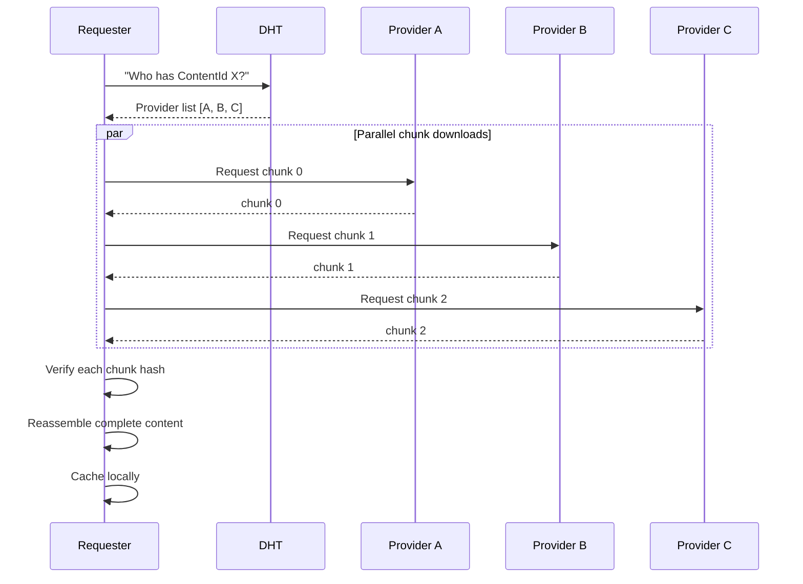
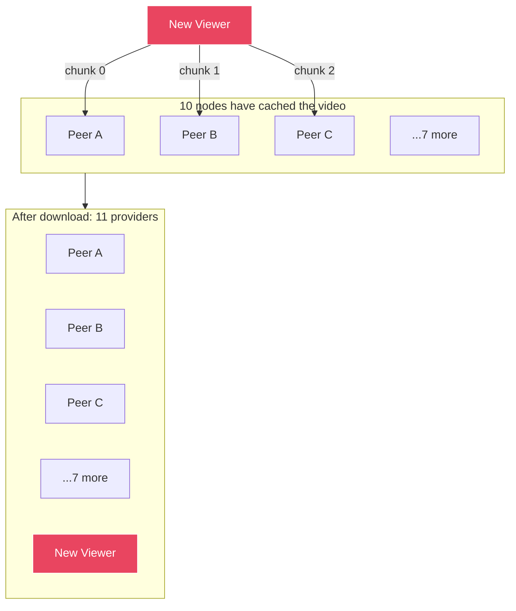
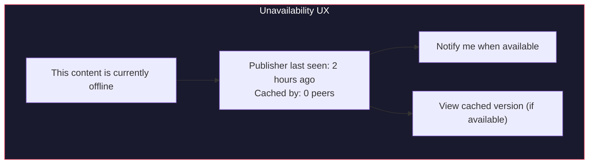

# Content Distribution and Caching

## Overview

dweb distributes content across the network using content addressing and peer-to-peer transfers. Popular content naturally replicates as more nodes cache it, improving availability and performance. This is particularly important for bandwidth-heavy use cases like video and music streaming.

## Content Publishing

When a user publishes content:



### Chunking

Large files are split into fixed-size chunks for efficient transfer and caching.

```
File: video.mp4 (500MB)

Chunk size: 256KB

Chunks:
  chunk_0: bytes[0..256KB]        -> ContentId: abc...
  chunk_1: bytes[256KB..512KB]    -> ContentId: def...
  chunk_2: bytes[512KB..768KB]    -> ContentId: ghi...
  ...
  chunk_n: bytes[last segment]    -> ContentId: xyz...

Manifest:
  {
    name: "video.mp4",
    total_size: 500_000_000,
    chunk_size: 262_144,
    chunks: [abc..., def..., ghi..., ..., xyz...],
    content_type: "video/mp4",
  }
  -> ManifestId: mno...
```

Benefits of chunking:
- **Parallel downloads** from multiple peers simultaneously
- **Partial caching** -- nodes cache individual chunks, not whole files
- **Resume** -- interrupted downloads continue from the last chunk
- **Deduplication** -- identical chunks across files are stored once
- **Streaming** -- video/audio can start playing before full download

## Content Fetching

When a user requests content:



### Provider Selection

When multiple providers are available, the node selects based on:

```
Priority:
  1. Local cache (instant, no network)
  2. LAN peers (fast, free bandwidth)
  3. Peers with low latency
  4. Peers with high bandwidth
  5. Relay peers (last resort)
```

### Swarming

For popular content, downloading resembles BitTorrent:



The more popular content is, the faster it downloads. This is the opposite of centralized hosting where popularity = more server load = slower.

## Caching

### Cache Policy

Every node maintains a content cache with LRU (Least Recently Used) eviction.

```toml
[cache]
max_size = "2GB"              # total cache size
min_free_disk = "1GB"         # stop caching if disk gets too low
eviction_policy = "lru"       # least recently used
pin_limit = "500MB"           # max explicitly pinned content
```

### What Gets Cached

```
Automatically cached:
  - Any content fetched from the network (on access)
  - App WASM binaries and assets (on install)
  - Frequently accessed public content from subscribed peers

Not cached:
  - Private/encrypted content from other users (no point, can't read it)
  - Content explicitly marked no-cache by publisher

Pinned (cached permanently until unpinned):
  - Content the user explicitly pins
  - Content from redundancy group members
  - Installed app binaries
```

### Cache Contribution

Nodes serve cached content to other peers, contributing bandwidth to the network. This is opt-in and configurable:

```toml
[cache.sharing]
enabled = true
max_upload_bandwidth = "5MB/s"    # bandwidth allocated to serving cache
serve_while_on_battery = false    # pause when on battery power
serve_on_metered = false          # pause on metered connections
```

## Streaming

### Video Streaming

Video files use a specialized chunking strategy for streaming:

```
Video file split into:
  - Manifest with byte-range-to-chunk mapping
  - Sequential chunks (for linear playback)
  - Optional: multiple quality levels (adaptive bitrate)

Playback:
  1. Browser requests video via localhost HTTP
  2. Node serves chunks as HTTP range responses
  3. Chunks fetched from network on-demand (prefetch ahead of playback)
  4. Browser plays via standard <video> tag
  5. Buffering strategy: prefetch next N chunks while playing current

Seeking:
  1. User seeks to timestamp T
  2. Map T to byte offset to chunk index
  3. Fetch that chunk (and following chunks) from network
  4. Continue playback from new position
```

### Audio Streaming

Same model as video. Chunks are smaller (64KB) for faster start time.

### Live Streaming (Future)

Live content uses a different model since content isn't pre-chunked:

```
1. Streamer's node encodes live video into chunks in real-time
2. Each chunk is published immediately (no full-file hash)
3. Viewers subscribe to the streamer's chunk stream
4. Chunks propagate through the viewer swarm
5. Latency target: 5-15 seconds (similar to HLS/DASH)
```

## Content Availability

### Availability Tiers

```
Tier 1: Always available
  - User's own published content (while node is online)
  - Pinned content on user's node
  - Content replicated by redundancy group

Tier 2: Probably available
  - Popular content cached by many nodes
  - Content from active peers who are usually online

Tier 3: Sometimes available
  - Content from peers who are rarely online
  - Unpopular content only cached by a few nodes

Tier 4: Offline
  - Publisher offline, no cache anywhere
  - Display: "This content is currently unavailable"
  - Queue for fetch when any provider comes online
```

### Improving Availability

Strategies in order of effort:

```
1. Caching (automatic)
   More viewers = more cache copies = more availability

2. Pinning peers (easy, social)
   Ask a friend to pin your content: dweb pin request <peer>

3. Redundancy groups (reliable, cooperative)
   Join a group of 5-10 nodes that keep each other's content alive

4. Always-on node (guaranteed)
   Run dweb on a Raspberry Pi, old laptop, or $5/month VPS
```

### Unavailability UX

When content is unavailable, the experience should be graceful:



## Bandwidth Economics

dweb has no built-in token or payment system for bandwidth. Instead, it relies on:

1. **Reciprocity** -- nodes that download also upload (cache sharing)
2. **Social incentive** -- redundancy groups are mutual arrangements
3. **Self-interest** -- caching popular content means faster access for yourself too
4. **Optional tipping** -- apps can integrate external payment for premium content

This avoids the complexity of token economics while still incentivizing participation. The network functions like BitTorrent: most users contribute by default because the protocol is designed that way.
