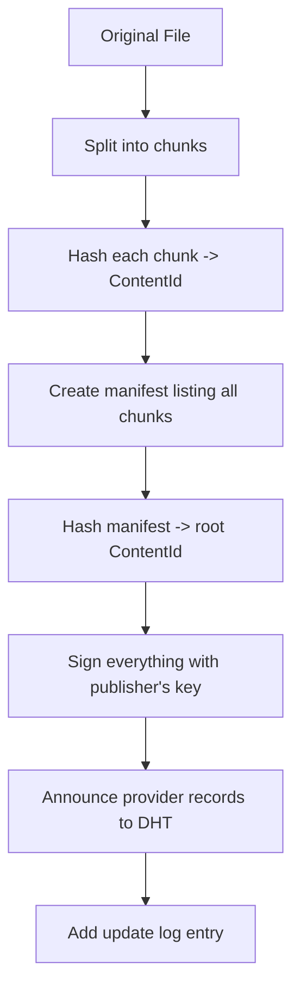
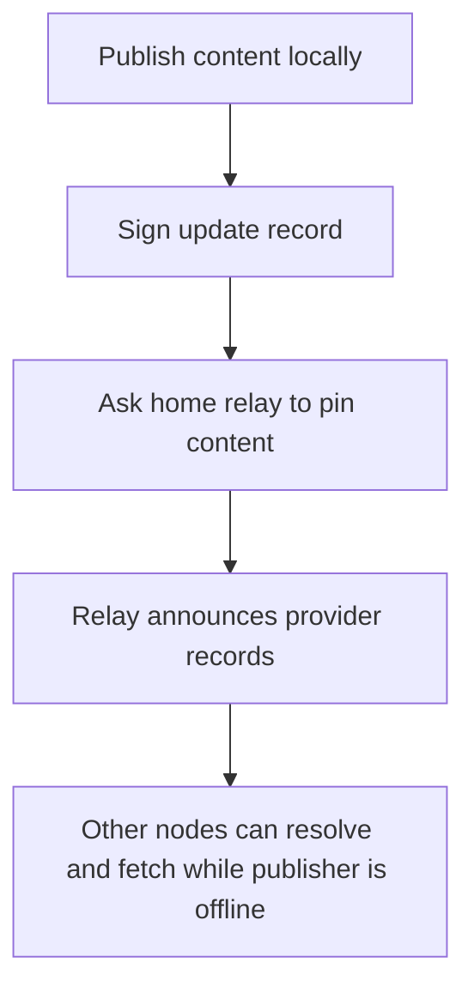
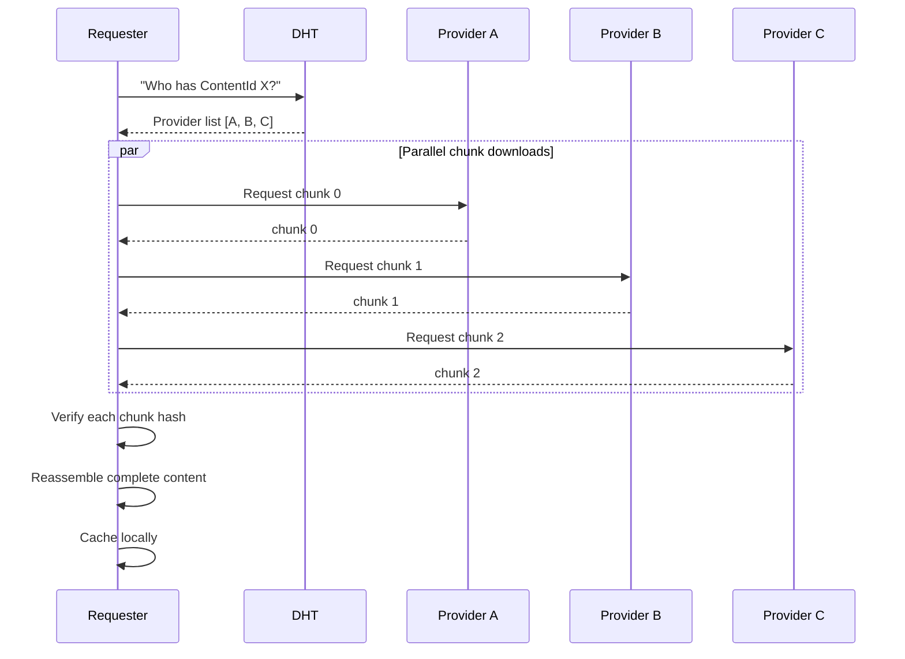
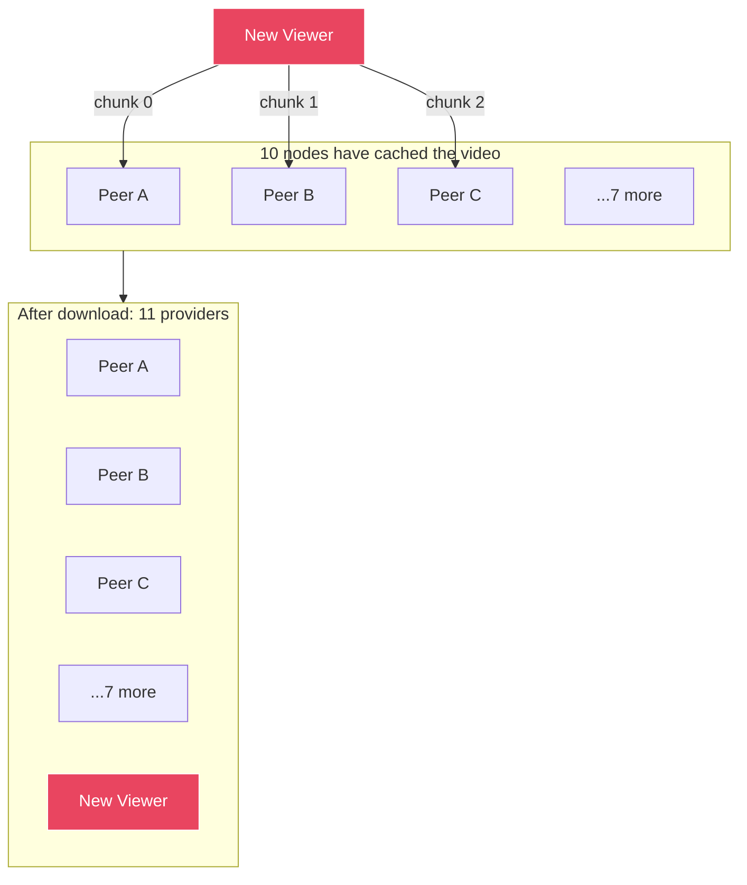
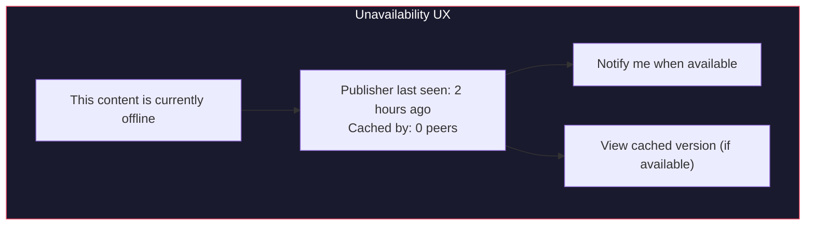

# Content Distribution and Caching

## Overview

jolt distributes content across the network using content addressing and peer-to-peer transfers. Popular content naturally replicates as more nodes cache it, improving availability and performance. This is particularly important for bandwidth-heavy use cases like video and music streaming.

Availability is not magic. If the publisher's node is offline, some other online node must have the content. jolt's answer is owner-directed relay pinning plus opportunistic caching:

- **Pinning** is intentional. The owner or local user asks a node to keep content.
- **Caching** is opportunistic. A node may keep content it fetched and may evict it later.
- **Mirroring** is future work. Owner-authorized relay-to-relay replication can be added later.

## Content Publishing

When a user publishes content:



If the user has a home relay, publishing also asks that relay to pin the content and the signed update record:



### Chunking

Large files are split into fixed-size chunks for efficient transfer and caching.

```
File: video.mp4 (500MB)

Chunk size: 256KB

Chunks:
  chunk_0: bytes[0..256KB]        -> ContentId: abc...
  chunk_1: bytes[256KB..512KB]    -> ContentId: def...
  chunk_2: bytes[512KB..768KB]    -> ContentId: ghi...
  ...
  chunk_n: bytes[last segment]    -> ContentId: xyz...

Manifest:
  {
    name: "video.mp4",
    total_size: 500_000_000,
    chunk_size: 262_144,
    chunks: [abc..., def..., ghi..., ..., xyz...],
    content_type: "video/mp4",
  }
  -> ManifestId: mno...
```

Benefits of chunking:
- **Parallel downloads** from multiple peers simultaneously
- **Partial caching** -- nodes cache individual chunks, not whole files
- **Resume** -- interrupted downloads continue from the last chunk
- **Deduplication** -- identical chunks across files are stored once
- **Streaming** -- video/audio can start playing before full download

## Content Fetching

When a user requests content:



### Provider Selection

When multiple providers are available, the node selects based on:

```
Priority:
  1. Local cache (instant, no network)
  2. LAN peers (fast, free bandwidth)
  3. Peers with low latency
  4. Peers with high bandwidth
  5. Relay peers (last resort)
```

### Swarming

For popular content, downloading resembles BitTorrent:



The more popular content is, the faster it downloads. This is the opposite of centralized hosting where popularity = more server load = slower.

## Caching

### Cache Policy

Every node maintains a content cache with LRU (Least Recently Used) eviction.

```toml
[cache]
max_size = "2GB"              # total cache size
min_free_disk = "1GB"         # stop caching if disk gets too low
eviction_policy = "lru"       # least recently used
pin_limit = "500MB"           # max explicitly pinned content
```

### What Gets Cached

```
Automatically cached:
  - Any content fetched from the network (on access)
  - App WASM binaries and assets (on install)
  - Frequently accessed public content from subscribed peers

Not cached:
  - Content explicitly marked no-cache by publisher

May be cached but unreadable:
  - Private/encrypted content from other users
  - The cache can improve availability even if the caching node cannot decrypt it

Pinned (cached permanently until unpinned):
  - Content the user explicitly pins
  - Content the owner asked this relay to pin
  - Installed app binaries
```

### Cache Contribution

Nodes serve cached content to other peers, contributing bandwidth to the network. This is opt-in and configurable:

```toml
[cache.sharing]
enabled = true
max_upload_bandwidth = "5MB/s"    # bandwidth allocated to serving cache
serve_while_on_battery = false    # pause when on battery power
serve_on_metered = false          # pause on metered connections
```

## Streaming

### Video Streaming

Video files use a specialized chunking strategy for streaming:

```
Video file split into:
  - Manifest with byte-range-to-chunk mapping
  - Sequential chunks (for linear playback)
  - Optional: multiple quality levels (adaptive bitrate)

Playback:
  1. Browser requests video via localhost HTTP
  2. Node serves chunks as HTTP range responses
  3. Chunks fetched from network on-demand (prefetch ahead of playback)
  4. Browser plays via standard <video> tag
  5. Buffering strategy: prefetch next N chunks while playing current

Seeking:
  1. User seeks to timestamp T
  2. Map T to byte offset to chunk index
  3. Fetch that chunk (and following chunks) from network
  4. Continue playback from new position
```

### Audio Streaming

Same model as video. Chunks are smaller (64KB) for faster start time.

### Live Streaming (Future)

Live content uses a different model since content isn't pre-chunked:

```
1. Streamer's node encodes live video into chunks in real-time
2. Each chunk is published immediately (no full-file hash)
3. Viewers subscribe to the streamer's chunk stream
4. Chunks propagate through the viewer swarm
5. Latency target: 5-15 seconds (similar to HLS/DASH)
```

## Content Availability

The honest rule is:

```
Content is available while at least one node that has it is online and willing to serve it.
```

Availability comes from:

```
1. The publisher's node
   Available while the user's own node is online.

2. Home relay pinning
   The user's relay keeps selected published content online.

3. Owner-directed multi-relay pinning
   The user's node may upload and pin content on more than one relay.

4. Cache-on-fetch
   Nodes that fetch content may cache and serve it.
```

Relays should not silently create durable copies on other relays in v0. Replication is owner-directed so the user's key remains the authority over intentional persistence.

### Unavailability UX

When content is unavailable, the experience should be graceful:



## Bandwidth Contribution

jolt has no built-in token or payment system for bandwidth. For the core protocol, payment is out of scope. Participation relies on:

1. **Reciprocity** -- nodes that download also upload (cache sharing)
2. **Social incentive** -- redundancy groups are mutual arrangements
3. **Self-interest** -- caching popular content means faster access for yourself too

This avoids the complexity of token economics in the core protocol. The network functions like BitTorrent: most users contribute by default because the protocol is designed that way.
