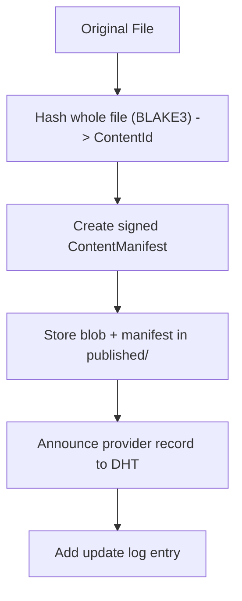
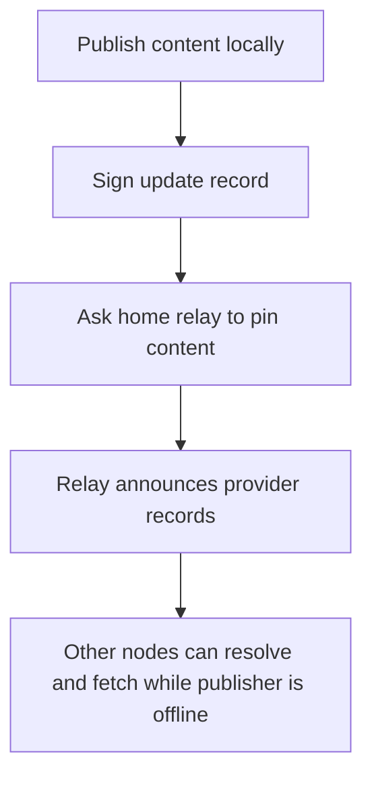
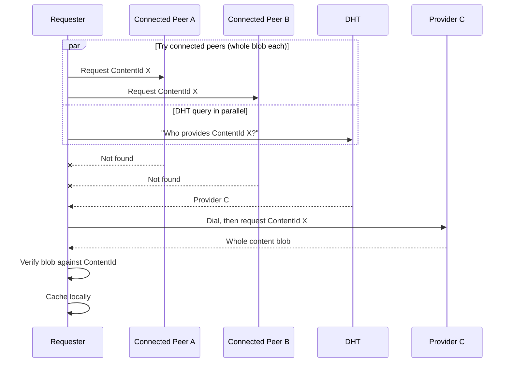
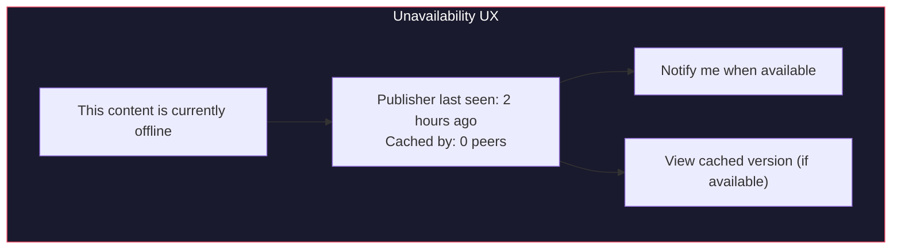

# Content Distribution and Caching

## Overview

jolt distributes content across the network using content addressing and peer-to-peer transfers. Popular content naturally replicates as more nodes cache it, improving availability and performance. This is particularly important for bandwidth-heavy use cases like video and music streaming.

Availability is not magic. If the publisher's node is offline, some other online node must have the content. jolt's answer is owner-directed relay pinning plus opportunistic caching:

- **Pinning** is intentional. The owner or local user asks a node to keep content.
- **Caching** is opportunistic. A node may keep content it fetched and may evict it later.
- **Mirroring** is future work. Owner-authorized relay-to-relay replication can be added later.

## Content Publishing

When a user publishes content:



Content moves as whole blobs; there is no chunking. The manifest describes a single blob:

```rust
struct ContentManifest {
    content_id: ContentId,
    size: u64,
    content_type: String,
    publisher_key: Vec<u8>,
    signature: Vec<u8>,
}
```

If the user has a home relay, publishing also asks that relay to pin the content and the signed update record:



## Content Fetching

Fetching is coordinated by the `FetchManager` in jolt-network. It asks every currently connected peer for the whole blob in parallel, while a DHT provider query runs alongside. If no connected peer has the content, the node dials a provider found via the DHT and requests the blob from it. The first successful whole-blob response wins; the fetch moves through the states `TryingPeers -> QueryingDht -> WaitingForProvider -> FetchingFromProvider`.



### Provider Selection

There is no latency or bandwidth ranking. The lookup order is:

```
Priority:
  1. Local store (published content, then cache)
  2. Currently connected peers (tried in parallel)
  3. Providers discovered via the DHT
```

## Caching

### Cache Policy

Every node maintains a content cache with LRU (Least Recently Used) eviction. The only configurable knob is the cache size:

```rust
struct CacheConfig {
    max_size_bytes: u64,   // default 2 GB
}
```

Eviction removes non-pinned entries in ascending last-accessed order until the new content fits. Pinned content is never evicted; if pinned content alone fills the cache, further caching fails with a cache-full error. The LRU policy is hard-coded, and there are no `min_free_disk` or pin-size limits.

### What Gets Cached

```
Automatically cached:
  - Any content fetched from the network (on access)

May be cached but unreadable:
  - Private/encrypted content from other users
  - The cache can improve availability even if the caching node cannot decrypt it

Pinned (cached permanently until unpinned):
  - Content the user explicitly pins
  - Content the owner asked this relay to pin
```

There is no publisher no-cache flag. Caching app binaries on install belonged to the abandoned in-process app model (see [App Boundary and Sessions](15-app-boundary-and-sessions.md)).

### Cache Contribution

Nodes serve cached content to any peer that requests it over the content fetch protocol, contributing bandwidth to the network. There is currently no gating: serving is always on.

## Content Availability

The honest rule is:

```
Content is available while at least one node that has it is online and willing to serve it.
```

Availability comes from:

```
1. The publisher's node
   Available while the user's own node is online.

2. Home relay pinning
   The user's relay keeps selected published content online.

3. Owner-directed multi-relay pinning
   The user's node may upload and pin content on more than one relay.

4. Cache-on-fetch
   Nodes that fetch content may cache and serve it.
```

Relays should not silently create durable copies on other relays in v0. Replication is owner-directed so the user's key remains the authority over intentional persistence.

### Unavailability UX

When content is unavailable, the experience should be graceful:



## Bandwidth Contribution

jolt has no built-in token or payment system for bandwidth. For the core protocol, payment is out of scope. Participation relies on:

1. **Reciprocity** -- nodes that download also upload (cache sharing)
2. **Social incentive** -- home relays and pinning are mutual arrangements
3. **Self-interest** -- caching popular content means faster access for yourself too

This avoids the complexity of token economics in the core protocol. The network functions like BitTorrent: most users contribute by default because the protocol is designed that way.
