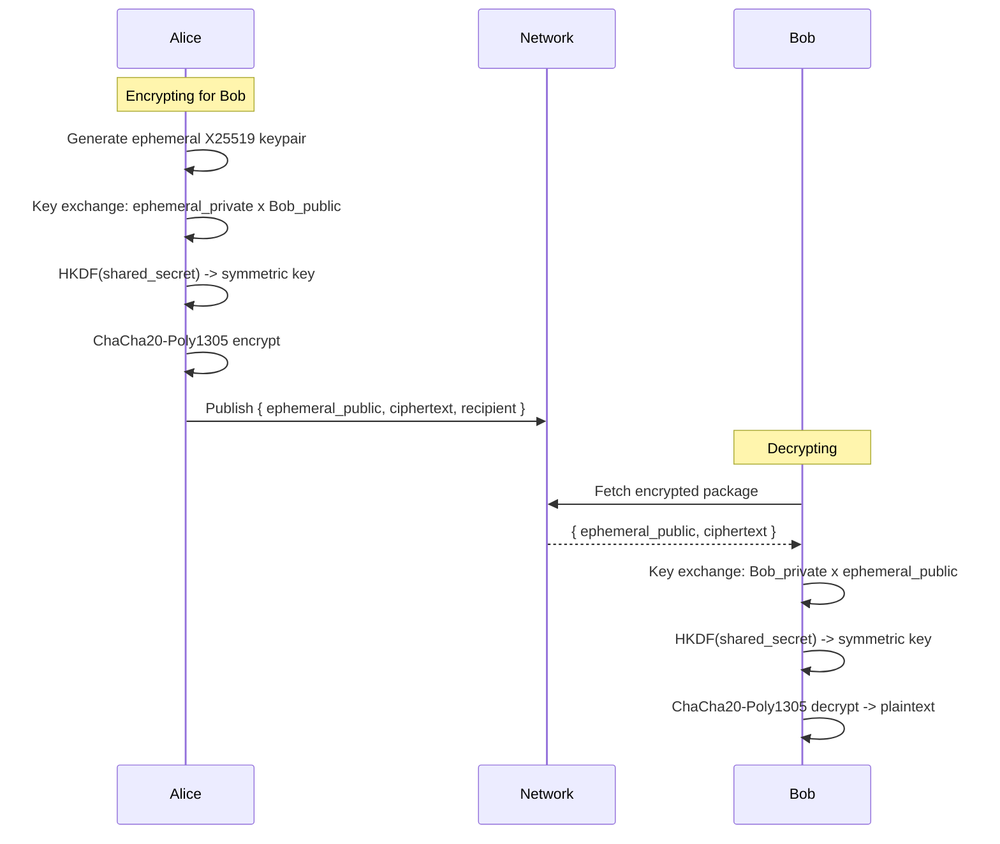
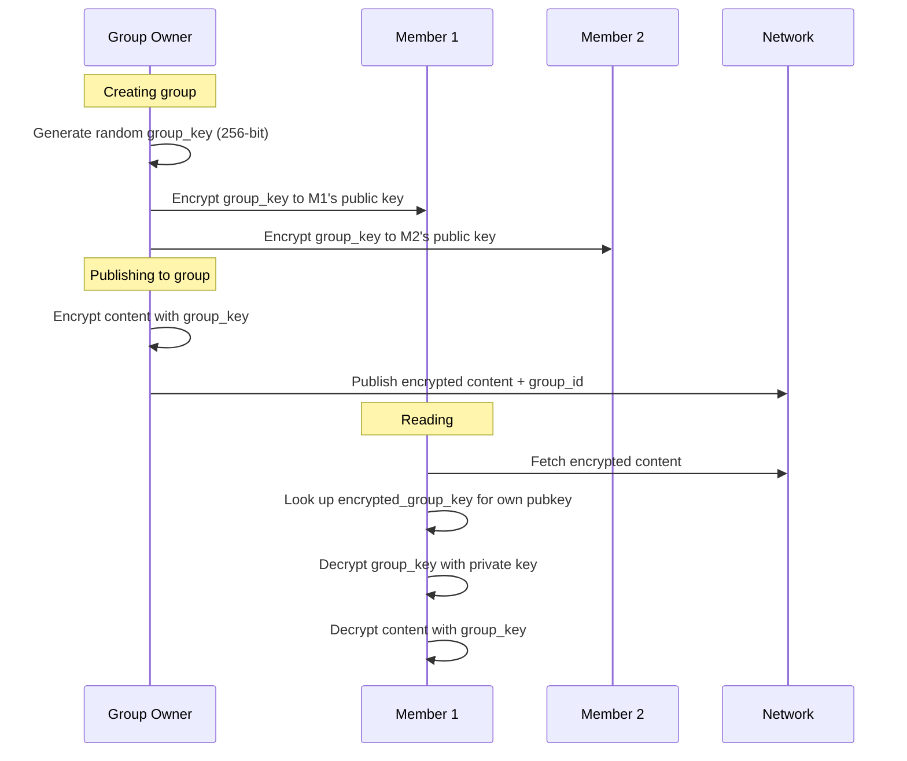
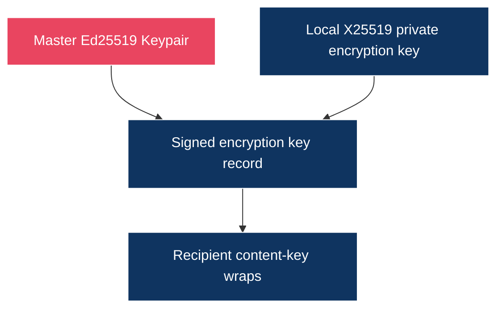

# Access Control

## Overview

jolt supports both public and private content. Public content is accessible to anyone on the network. Private content is encrypted and only readable by authorized users. Access control is enforced cryptographically -- there is no server to bypass.

Encryption must be crypto-agile. The protocol should be able to move from today's algorithms to post-quantum-safe or hybrid schemes without changing the ownership model. Relays and caches store ciphertext; authorization lives in keys and signed records, not in relay-side access checks.

> Design update: the current encrypted object direction is
> [Encrypted Object Envelope](16-encrypted-object-envelope.md). Identity
> encryption keys are separate signed records, not keys derived from the Ed25519
> identity key.

## Visibility Levels

### Public

Default for published content. Anyone on the network can fetch, cache, and view it.

```
Published as public:
  - Content stored as plaintext
  - Content-addressed (hash of raw bytes)
  - Cacheable by any node
  - Signed by publisher (authenticity, not secrecy)
```

### Private (Single Recipient)

Encrypted for a specific user. Only the sender and recipient can read it.



The encrypted package can be cached by any node, but only Bob can decrypt it.

### Private (Group)

Encrypted for a group of users. All group members can read the content.



### Group Membership Changes

**Adding a member:**
```
1. Group owner encrypts group_key to new member's public key
2. Publishes updated member list
3. New member can now decrypt all existing and future group content
```

**Removing a member:**
```
1. Generate new group_key
2. Encrypt new group_key to all remaining members
3. All future content uses the new group_key
4. Revoked member is immediately locked out of new content
```

The revoked member may still have copies of old content they previously downloaded and decrypted -- this is a physical reality, not a jolt limitation. The same is true of email, Slack, or any other system. Once bytes are on someone's device, no protocol can force deletion. What matters is that revocation is **immediate and forward-secure**: from the moment of revocation, the removed member cannot decrypt anything new.

## Access Control in Apps

Apps can use the access control system to implement features:

### Private Messaging

```
App: jolt-chat

Sending a DM:
  1. Encrypt message for recipient using crypto host API
  2. Publish encrypted message to network
  3. Recipient's node detects message addressed to them
  4. Decrypts and stores in app data
```

### Private Communities

```
App: jolt-forum

Creating a private forum:
  1. Forum creator generates group key
  2. Invites members (encrypts group key to each)
  3. All posts encrypted with group key
  4. Only members can read posts
  5. New members get group key, can read history
```

### Deferred: Paid Content

Paid content is intentionally outside the core protocol for now. The access-control layer should only model cryptographic authorization: who can decrypt which content, and how keys are shared or revoked.

## Key Management

### Key Storage

```
~/.jolt/
  identity/
    keypair.enc               # master Ed25519 keypair (encrypted at rest)
    encryption_keys.enc       # private encryption keys for signed key records
  keys/
    groups/
      <group-id>.enc          # group keys (encrypted with master key)
    app_keys/
      <app-id>.enc            # per-app derived keys
```

### Key Authority



The identity signing key authorizes which encryption public keys belong to an
identity. It does not derive those encryption keys.

## Permissions and Consent

Access control decisions always require user consent:

```
Sharing content:
  User explicitly chooses recipients or "public"
  Apps cannot share data without the user's action

Receiving shared content:
  Encrypted content addressed to the user is automatically decrypted
  Apps can filter/display but cannot suppress

Group membership:
  User must accept invitation to join a group
  User can leave a group at any time
  Leaving deletes the group key from the node
```

## Threat Model

### What jolt Protects Against

- **Eavesdropping:** all P2P connections are encrypted (Noise protocol). Private content is end-to-end encrypted.
- **Data theft from servers:** there are no servers. Data is on user nodes, encrypted at rest.
- **Platform data mining:** no platform has access to user data.
- **Unauthorized access:** private content is cryptographically locked to authorized keys.
- **Impersonation:** all content is signed. Forging content requires the private key.
- **Metadata analysis (partial):** DHT queries are distributed, not centralized. But a determined observer can still see who talks to whom at the network level.

### What jolt Does Not Protect Against

- **Compromised node:** if your machine is compromised, your keys are compromised. This is true of all client-side systems.
- **Key loss:** if you lose your private key and have no backup, your identity and encrypted data are gone.
- **Traffic analysis:** a network observer can see that two nodes are communicating, even if they cannot read the content. Mix networks (like Tor) could be layered on top for stronger anonymity.
- **Recipient sharing:** once someone decrypts content, they can share it. DRM is not a goal.
- **Quantum computing (future):** Ed25519 and X25519 are not quantum-resistant. Migration to post-quantum algorithms will be needed when relevant.
