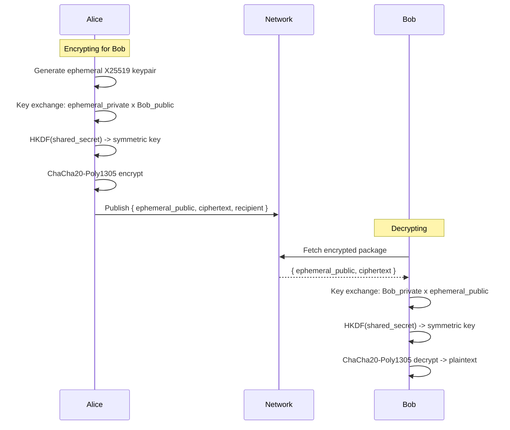
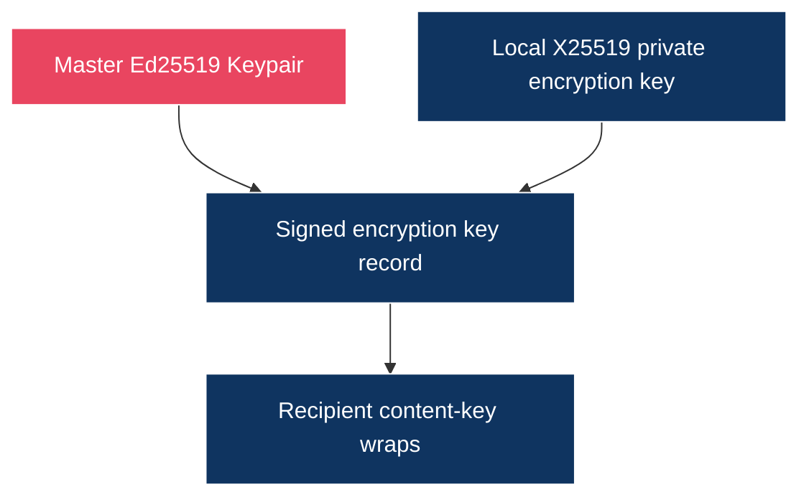

# Access Control

## Overview

jolt supports both public and private content. Public content is accessible to anyone on the network. Private content is encrypted and only readable by authorized users. Access control is enforced cryptographically -- there is no server to bypass.

Encryption must be crypto-agile. The protocol should be able to move from today's algorithms to post-quantum-safe or hybrid schemes without changing the ownership model. Relays and caches store ciphertext; authorization lives in keys and signed records, not in relay-side access checks.

> Design update: the current encrypted object direction is
> [Encrypted Object Envelope](16-encrypted-object-envelope.md). Identity
> encryption keys are separate signed records, not keys derived from the Ed25519
> identity key.

## Visibility Levels

### Public

Default for published content. Anyone on the network can fetch, cache, and view it.

```
Published as public:
  - Content stored as plaintext
  - Content-addressed (hash of raw bytes)
  - Cacheable by any node
  - Signed by publisher (authenticity, not secrecy)
```

### Private (Single Recipient)

Encrypted for a specific user. Only the sender and recipient can read it.



The encrypted package can be cached by any node, but only Bob can decrypt it.

### Private (Multiple Recipients)

The implemented envelope (doc 16) supports multiple recipients directly: the
content key is wrapped once per recipient identity (and per authorized device
key), so a set of identities can all decrypt the same object without a shared
group key.

## Access Control in Apps

App access to encryption and decryption is itself capability-checked. An app
session must hold `encrypt:<path>`, `decrypt:<path>`, or
`publish:encrypted:<path>` grants, approved by the user in Console, before the
daemon will encrypt, decrypt, or publish private content on its behalf (see
doc 15 for the session model and doc 16 for the envelope APIs).

Apps can use the access control system to implement features:

### Private Messaging

```
Example: Spoke encrypted replies

Sending a private reply:
  1. App asks the daemon to encrypt the reply to the recipient identity
     (encrypt:<path>)
  2. Publishes the encrypted envelope under its own path
     (publish:encrypted:<path>)
  3. Submits the encrypted bytes to the recipient's ingress endpoint
  4. Recipient app lists pending ingress; the user accepts; the app opens
     it with decrypt:<path>
```

### Private Communities

```
Example: a forum app

Creating a private forum:
  1. Forum app encrypts each post to the member identities
     (per-recipient content-key wraps, see doc 16)
  2. Inviting a member means including their identity as a recipient
  3. Only members can decrypt posts
  4. Community identity and membership records are the planned
     protocol-level direction (doc 21)
```

### Deferred: Paid Content

Paid content is intentionally outside the core protocol for now. The access-control layer should only model cryptographic authorization: who can decrypt which content, and how keys are shared or revoked.

## Key Management

### Key Storage

What exists on disk in v0:

```
<data-dir>/jolt/
  identity/
    keypair.bin        # Ed25519 signing key (raw bytes, unencrypted, 0600)
    public_key.pub     # shareable public key
```

Identity encryption keys (for the envelope model in doc 16) are stored by the
daemon alongside identity state; there are no encrypted `.enc` key files, no
group-key store, and no per-app derived keys. Encryption at rest for the
signing key is planned but not implemented (see docs 02 and 18).

### Key Authority



The identity signing key authorizes which encryption public keys belong to an
identity. It does not derive those encryption keys.

## Permissions and Consent

Access control decisions always require user consent:

```
Sharing content:
  User explicitly chooses recipients or "public"
  Apps cannot share data without the user's action

Receiving shared content:
  Nothing decrypts automatically. Decryption is an explicit, capability-checked
  app call (/app/v1/encrypted/decrypt or /open, gated by decrypt:<path>);
  opening ingress items requires ingress:read

Group membership:
  Community identity and membership are not implemented yet;
  the design direction is doc 21
```

## Threat Model

### What jolt Protects Against

- **Eavesdropping:** all P2P connections are encrypted at the transport layer (QUIC/TLS on the default iroh transport, Noise on the TCP demo transport). Private content is end-to-end encrypted.
- **Data theft from servers:** there are no servers. Data is on user nodes, encrypted at rest.
- **Platform data mining:** no platform has access to user data.
- **Unauthorized access:** private content is cryptographically locked to authorized keys.
- **Impersonation:** all content is signed. Forging content requires the private key.
- **Metadata analysis (partial):** DHT queries are distributed, not centralized. But a determined observer can still see who talks to whom at the network level.

### What jolt Does Not Protect Against

- **Compromised node:** if your machine is compromised, your keys are compromised. This is true of all client-side systems.
- **Key loss:** if you lose your private key and have no backup, your identity and encrypted data are gone.
- **Traffic analysis:** a network observer can see that two nodes are communicating, even if they cannot read the content. Mix networks (like Tor) could be layered on top for stronger anonymity.
- **Recipient sharing:** once someone decrypts content, they can share it. DRM is not a goal.
- **Quantum computing (future):** Ed25519 and X25519 are not quantum-resistant. Migration to post-quantum algorithms will be needed when relevant.
