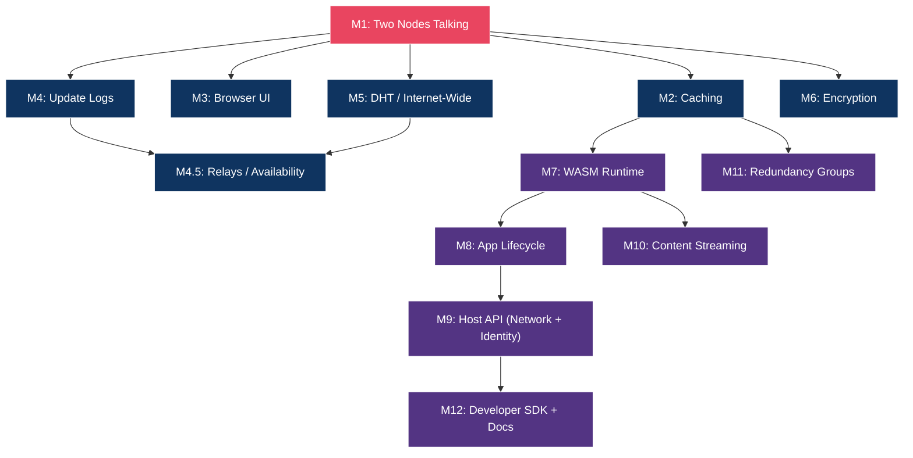

# Development Milestones

## M1: Two Nodes Talking

**Goal:** Two dweb nodes on a LAN discover each other and exchange a file.

**Deliverables:**
- Rust workspace with `dweb-core`, `dweb-identity`, `dweb-network`, `dweb-node` crates
- Ed25519 keypair generation and storage
- libp2p node with mDNS discovery
- Content-addressed file publishing (hash, store, announce)
- Content fetch protocol (request by ContentId, receive, verify)
- CLI interface: `dweb start`, `dweb publish <file>`, `dweb fetch <content-id>`

**Success criteria:** Node A publishes a file, Node B fetches it by ContentId, file integrity is verified.

---

## M2: Content Caching and Availability

**Goal:** Nodes cache content they fetch and serve it to other peers.

**Deliverables:**
- Local cache with LRU eviction
- Cache size configuration
- Nodes serve cached content to requesters (automatic re-sharing)
- Content pinning (prevent eviction)
- Cache statistics CLI: `dweb cache stats`, `dweb cache list`

**Success criteria:** Node A publishes, Node B fetches and caches, Node A goes offline, Node C fetches from Node B's cache.

---

## M3: Daemon Architecture, HTTP API, and Protocol Design

**Goal:** The dweb node runs as a persistent daemon. CLI commands and browser UI are thin clients that talk to the daemon via a localhost HTTP API. Connections stay alive for hole punching and content serving.

**Deliverables:**
- Protocol design document (connection lifecycle, content routing, handshake)
- Daemon process management (start, stop, status, auto-restart)
- `dweb-server` crate with axum HTTP server (localhost REST API)
- CLI commands refactored to call the daemon's API instead of creating throwaway nodes
- Persistent connection management (relay circuits maintained, dcutr completes)
- Docker Compose test environment (3-node network simulation)
- Basic browser UI: node status, peer list, publish/fetch content
- Register `dweb://` as OS protocol handler on install
- URI resolution: `dweb://` links resolve through the daemon

**Success criteria:** Daemon stays running, maintains relay circuits and DHT presence. `dweb fetch` talks to the daemon and gets content without creating a new node. dcutr hole-punching completes because connections persist. Docker tests verify the full flow.

---

## M4: Update Logs and Mutable Content

**Goal:** Users can update published content and peers can resolve the latest version.

**Deliverables:**
- `UpdateLog` implementation (append-only, signed, hash-chained)
- Update log sync protocol
- Mutable content resolution (PeerId -> latest content root)
- User profile (display name, bio)
- CLI: `dweb publish --update <path>`, `dweb resolve <peer-id>`

**Success criteria:** User publishes v1 of a file, updates to v2, other nodes resolve and fetch v2 by the user's PeerId.

---

## M4.5: Relays and Owner-Directed Availability

**Goal:** Users can keep published content online through a home relay without giving the relay ownership or authority over the content.

**Deliverables:**
- Relay capability model: discovery-only vs pinning relay
- Home relay configuration on the user node
- Pin request protocol: owner signs a request for a relay to keep a ContentId
- Relay stores pinned content and announces provider records
- Node-managed availability checks: user node verifies its home relay still serves pinned content
- Cache/pin terminology clarified in docs and API

**Non-goals:**
- Payments
- Storage markets
- Blockchain settlement
- Automatic relay-to-relay durable replication

**Success criteria:** Alice publishes content, her home relay pins it, Alice's node goes offline, Bob resolves Alice's latest signed record and fetches the content from the relay.

---

## M5: DHT and Internet-Wide Networking

**Goal:** Nodes discover each other and exchange content over the internet, not just LAN.

**Deliverables:**
- Kademlia DHT integration
- Bootstrap nodes (run at least 2 for the project)
- NAT traversal: UPnP, hole punching, relay fallback
- Peer exchange (PEX)
- Connection management and limits

**Success criteria:** Two nodes on different networks (different homes/offices) discover each other via DHT and exchange content.

---

## M6: Encryption and Access Control

**Goal:** Users can publish private content encrypted for specific recipients or groups.

**Deliverables:**
- `dweb-crypto` crate
- X25519 key derivation from Ed25519 identity
- Encrypt content for single recipient
- Group key management (create, distribute, rotate)
- Visibility levels: public, private, group
- CLI: `dweb publish --private --recipient <peer-id>`

**Success criteria:** Alice publishes encrypted content for Bob. Bob decrypts it. Carol cannot.

---

## M6.5: Built-In Space Lens

**Goal:** Show an application-shaped Jolt space before building a WASM runtime.

**Deliverables:**
- Built-in dashboard/client lens for opening a `.jolt` space.
- Minimal app-layer space manifest or generated HTML view.
- Relay-backed publish flow for the demo space.
- Bob can open Alice's space while Alice is offline.

**Success criteria:** A user can open an identity-owned space and see a useful rendered experience, not just CIDs or a file list. The implementation stays above the protocol layer.

---

## M7: WASM Runtime

**Goal:** The node can execute WASM applications in a sandboxed environment.

**Deliverables:**
- `dweb-runtime` crate with wasmtime integration
- Host API: storage (KV), logging
- Capability-based permission system
- Resource limits (memory, CPU, storage)
- App isolation (per-app sandbox)

**Success criteria:** A simple WASM app (counter that persists to KV store) runs on the node, data persists across restarts.

---

## M8: App Lifecycle

**Goal:** Users can install, run, update, and remove apps.

**Deliverables:**
- `dweb-apps` crate
- App manifest format
- App packaging: `dweb app pack`
- App publishing: `dweb app publish`
- App installation from network
- App update detection and installation
- App removal
- Browser UI: app launcher, install/update/remove

**Success criteria:** Developer publishes an app, user installs it from the network, app runs in browser, developer publishes update, user updates.

---

## M9: Host API - Network and Identity

**Goal:** WASM apps can communicate with peers and access identity.

**Deliverables:**
- Host API: peer messaging (send, receive, broadcast)
- Host API: peer discovery (list online peers running same app)
- Host API: identity (read peer ID, display name)
- Host API: crypto (encrypt for recipient, decrypt)
- App data sync protocol

**Success criteria:** A chat app where two users install it, discover each other, and exchange encrypted messages.

---

## M10: Content Streaming

**Goal:** Large files (video, audio) can be streamed efficiently.

**Deliverables:**
- File chunking (configurable chunk size)
- Parallel chunk downloads from multiple peers (swarming)
- HTTP range request support for browser-based playback
- Chunk-level caching
- Prefetch strategy for sequential playback
- Seek support

**Success criteria:** User publishes a video, another user streams it in the browser with reasonable start time and smooth playback.

---

## M11: Redundancy Groups

**Goal:** Groups of nodes cooperate to keep each other's content available.

**Deliverables:**
- Redundancy group creation and membership
- Content replication within groups
- Encrypted backup of private data to group members
- Group health monitoring
- Automatic sync when members come online

**Success criteria:** A group of 3 nodes. One goes offline. Its published content remains available via the other two.

---

## M12: Developer SDK and Documentation

**Goal:** Developers can build dweb apps easily.

**Deliverables:**
- `dweb-sdk-rust` crate with ergonomic host API wrappers
- `dweb-sdk-js` npm package (for QuickJS-based apps)
- App development tutorial
- API reference documentation
- Example apps: blog, chat, file sharing
- App template: `dweb app init --template <name>`

**Success criteria:** A developer with no dweb experience can follow the tutorial and publish a working app within an afternoon.

---

## Milestone Dependencies

M1 through M5 can be worked on somewhat in parallel. M4.5 depends on mutable records and internet-wide networking: a relay needs signed owner intent and a network path for others to resolve and fetch pinned content. M7-M9 build sequentially. M10, M11, and M12 can be developed independently once their dependencies are met.
