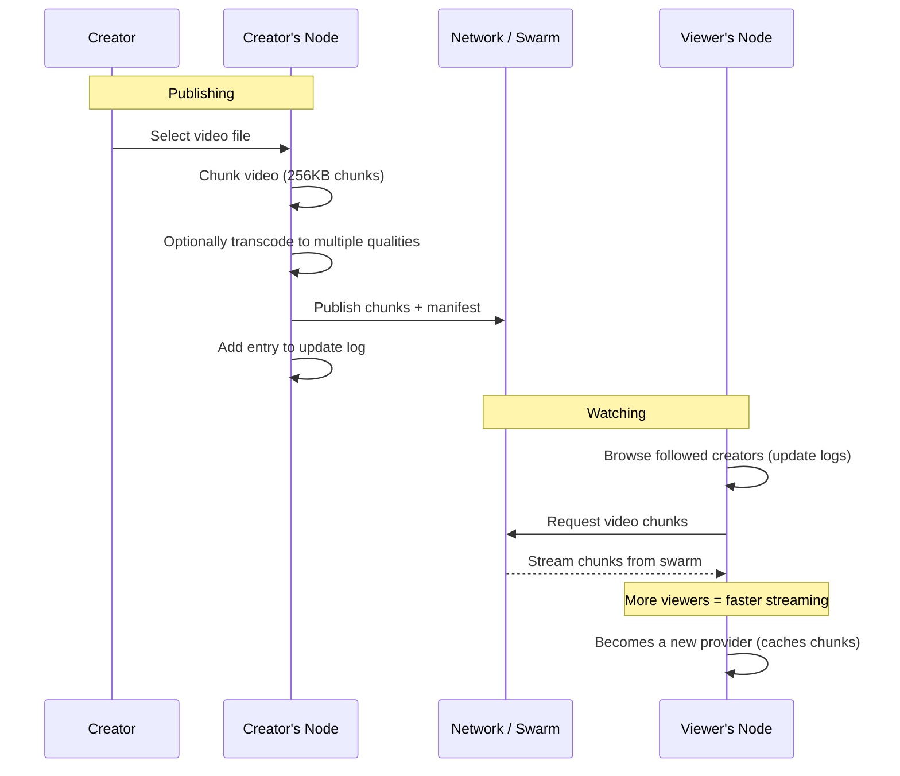
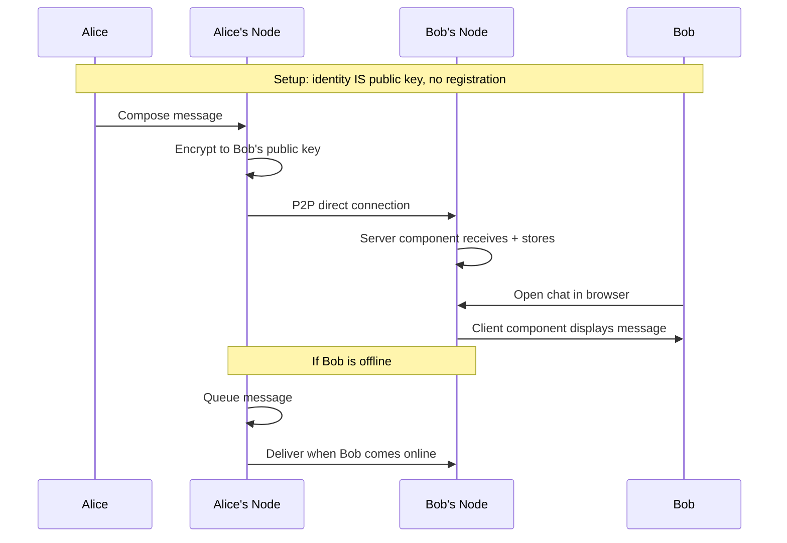
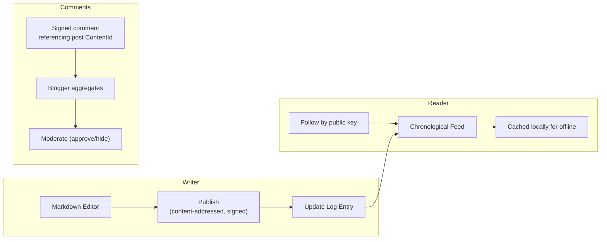
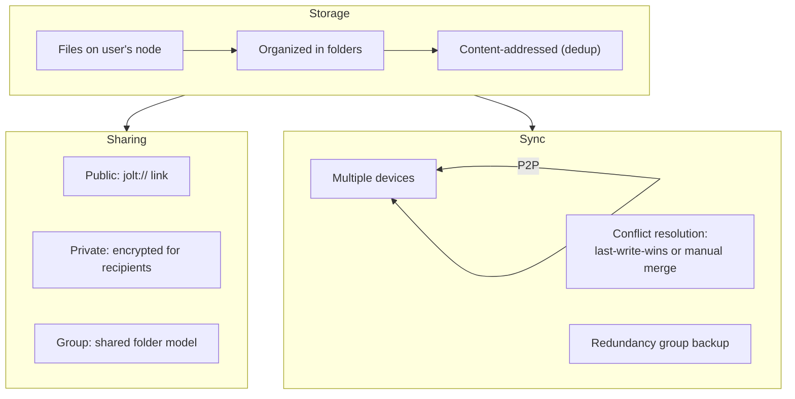
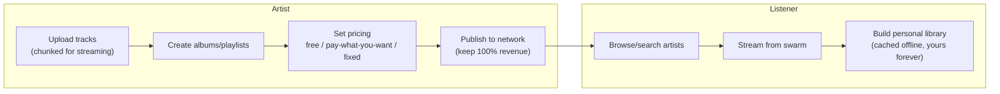
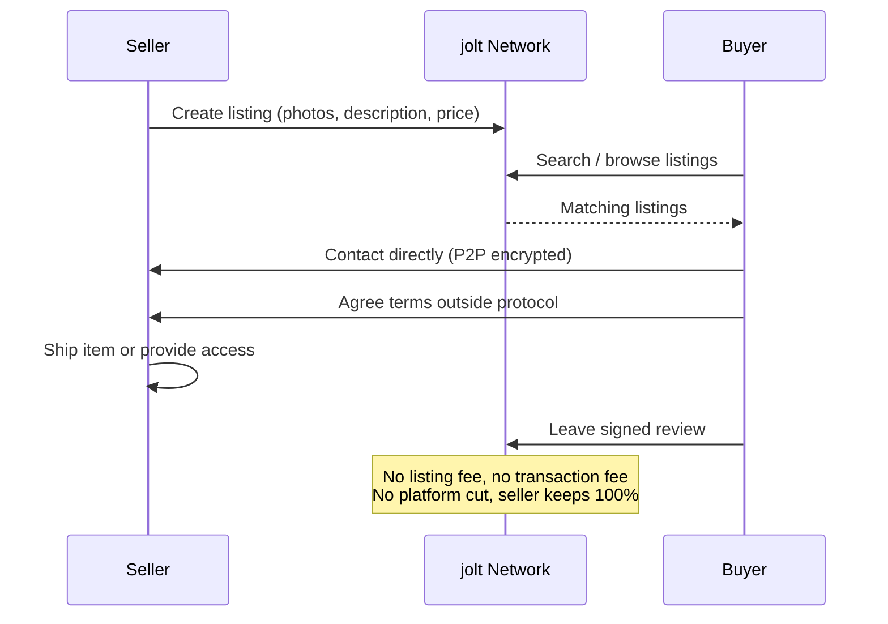
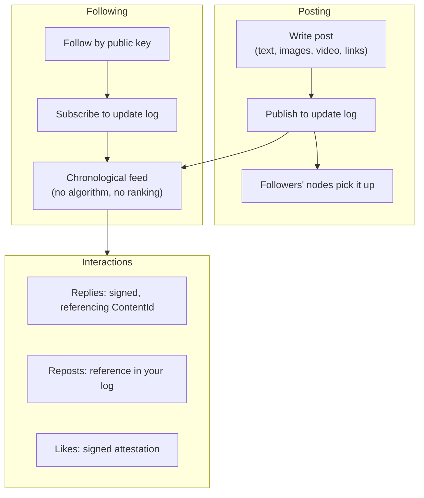
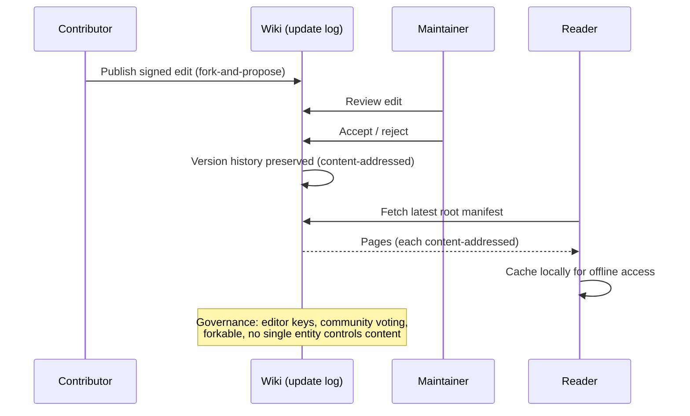

# Example Applications

> **Status: illustrative concepts.** None of the applications below are built,
> and this document predates the implemented app model. It is kept as a
> sketchbook of what the primitives could support, not a roadmap.
>
> The real example application is
> [Spoke](https://github.com/alexanderwanyoike/spoke), an external social app
> (profiles, posts, feed, encrypted replies) that runs against the local
> daemon through a capability-scoped session and never holds keys. The
> implemented app boundary and capability vocabulary are defined in
> [App Boundary and Sessions](15-app-boundary-and-sessions.md).
>
> The `Permissions:` lines below use an old capability sketch (`storage`,
> `network`, ...). A real app requests path-scoped capabilities instead, e.g.
> a video app would request `publish:/video/*`, `inventory:/video/*`,
> `enumerate:any:/video/*`, and `fetch:public`.

## Overview

These are example application concepts that illustrate what could be built on jolt. Each follows the same model: an app the user runs locally, data owned by the user's identity, communication via P2P.

---

## jolt-video

**Decentralized video platform. YouTube without YouTube.**

Type: Client-side (hybrid optional for background transcoding)

**Discovery:** Follow by public key, chronological feed (no algorithm), DHT search, curated channels

**Permissions:** storage, network, content

**Sustainability:** No ads and no platform-controlled monetization in the core protocol. Any app-level economic model is outside the protocol.

---

## jolt-chat

**End-to-end encrypted messaging. Signal without the phone number.**

Type: Hybrid (server for background message receiving, client for UI)

**Group chat:** Creator generates group key, encrypts to each member's public key. All members read, outsiders cannot.

**Permissions:** storage, network, crypto, identity

---

## jolt-blog

**Personal publishing. Your blog, your rules, forever.**

Type: Client-side

**Permissions:** storage, network, content

---

## jolt-drive

**Personal file storage and sharing. Dropbox without the cloud.**

Type: Client-side (hybrid optional for background sync)

**Permissions:** storage, network, crypto

---

## jolt-music

**Music streaming and distribution. Spotify without the middleman.**

Type: Client-side

**Discovery:** Follow artists (update logs), genre tags, community playlists, no algorithm

**Permissions:** storage, network, content

---

## jolt-market

**Peer-to-peer marketplace. eBay/Etsy without the fees.**

Type: Client-side

**Trust:** Signed reviews from verified buyers, reviews tied to real jolt identities (Sybil-resistant), public transaction history

**Permissions:** storage, network, identity, crypto

---

## jolt-social

**Social networking. The feed without the algorithm.**

Type: Client-side

**Privacy:** Public or group-only posts, encrypted DMs, no tracking, node-level blocking

**Permissions:** storage, network, content, identity

---

## jolt-wiki

**Collaborative knowledge base. Wikipedia without the foundation.**

Type: Client-side

**Permissions:** storage, network, content

---

## App Development Patterns

All the above apps share common patterns:

1. **Local-first clients** -- UI and logic run in an app the user controls,
   talking to the local daemon through a scoped session, not to a server
2. **Local data** -- all user data stored on the user's node
3. **P2P communication** -- users interact directly, no intermediary
4. **Content-addressed publishing** -- published content is immutable and verifiable
5. **Update logs for mutability** -- subscriptions and feeds use append-only logs
6. **Encryption for privacy** -- private content is encrypted to specific keys
7. **Signed everything** -- all actions are signed, providing identity and accountability
