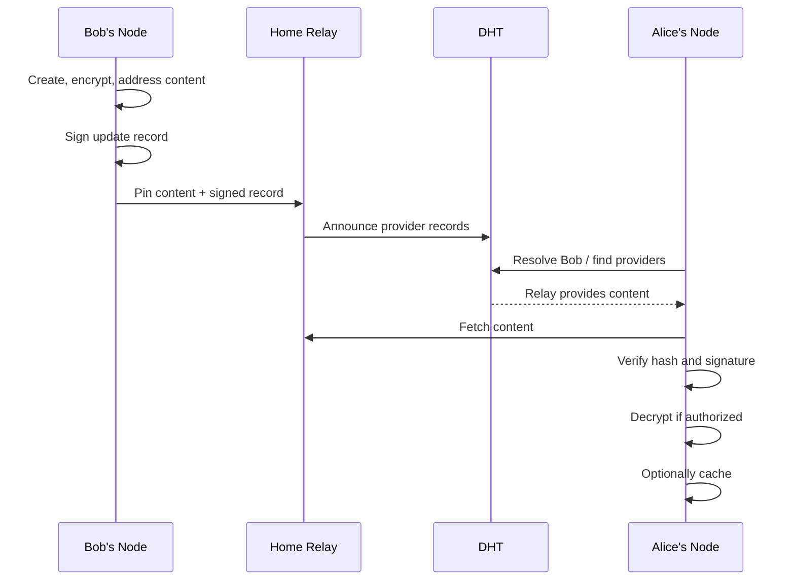

# Relays and Availability

## Problem

dweb can prove ownership with keys and content hashes, but availability is a physical problem. If Bob's node is offline and no other online node has Bob's content, nobody can fetch it.

The current web has the same constraint:

1. Post to a centralized platform.
2. Run a VPS and host it yourself.
3. Ask someone else to keep it online.

dweb does not remove that constraint. It changes the authority model. In dweb, Bob's key is the authority, and relays are replaceable availability providers.

## Relay Definition

A relay is an always-online dweb node that helps other nodes remain reachable.

Relays can provide one or more capabilities:

| Capability | Meaning |
|---|---|
| Discovery | Help peers find each other and find providers for content. |
| NAT assistance | Help peers connect when direct paths are hard. |
| Pinning | Keep owner-requested content available. |
| Serving | Serve content to requesters. |
| Caching | Keep fetched content opportunistically. |

A relay is not a platform account, not a source of truth, and not the owner of the content it carries.

## User Experience

Users should not have to think about relays in normal use.

Bob should see:

```
Post published.
```

Bob's node should handle:

```
1. Create content.
2. Encrypt private content.
3. Address content by hash.
4. Sign Bob's update record.
5. Choose Bob's relay or relays.
6. Upload and pin the content.
7. Announce provider records.
8. Re-check availability over time.
```

The user's node thinks about relays so the user does not have to.

## Home Relay

The first availability model is a home relay.

A home relay is a delegated online presence for a user. It pins the user's published content and signed records so the user remains reachable when their personal device is offline.

Examples:

- A VPS Bob runs.
- A home server.
- A friend or family relay.
- A community relay.
- A relay bundled or recommended by a client.

Bob can change home relays without changing identity. His content IDs, signatures, and update log remain valid.

## Owner-Directed Replication

Durable replication should be owner-directed.

For v0, relays should not independently copy Bob's pinned content to other relays. Bob's node decides where intentional durable copies live.

```
Bob's node -> Relay A
Bob's node -> Relay B
Bob's node -> Relay C
```

This keeps authority clear:

```
Bob's key decides where Bob's content is intentionally persisted.
```

Relays may still cache content opportunistically when they fetch or serve it, but cache copies are not durable promises.

## Cache, Pin, Mirror

The protocol should distinguish three storage modes:

| Mode | Meaning |
|---|---|
| Cache | Temporary and opportunistic. A node may evict it. |
| Pin | Intentional storage requested by the owner or local user. |
| Mirror | Future feature: owner-authorized relay-to-relay replication. |

For now, Jolt should implement cache and pin. Mirror can come later.

## Availability Rule

The honest v0 rule is:

```
Content is available while at least one node that has it is online and willing to serve it.
```

Caching improves availability naturally. Relays improve availability deliberately. Neither changes content ownership.

## Publish Flow



## What This Avoids

The core protocol should not require:

- Payments.
- Storage markets.
- Relay-to-relay replication.
- Blockchain consensus.
- Users manually choosing relays for every post.

Those can be extensions. The first requirement is simpler:

> A user can publish signed/encrypted content, delegate availability to a relay, and move between relays without giving up ownership.
